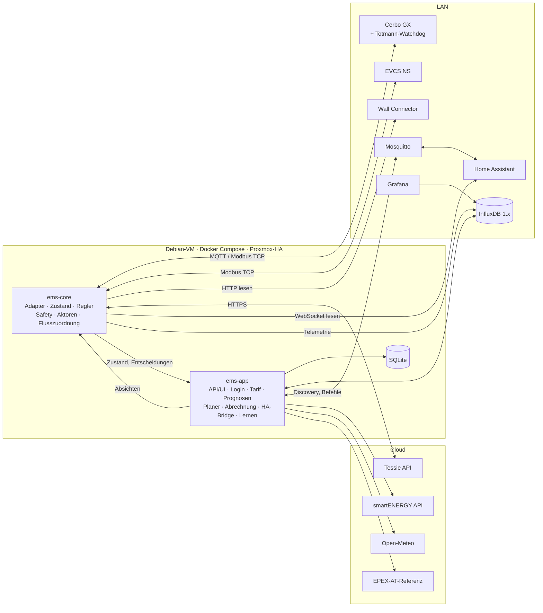

# BindaEMS – Design-Spezifikation

| | |
|---|---|
| Stand | 2026-10-08 |
| Status | Entwurf zur Freigabe |
| Umfang | Gesamtsystem, Phasen 1–5 |
| Branch | `claude/ems-haus-akku-pv-93c0s6` |

## 0. Kurzfassung

BindaEMS ist ein lokal betriebenes Energiemanagementsystem für einen Hausakku (Victron ESS), eine AC-gekoppelte PV-Anlage (Huawei) und zwei Wallboxen (Victron EV Charging Station NS, Tesla Wall Connector Gen 3). Es senkt die Stromkosten bei dynamischem Tarif (smartENERGY smartCONTROL, Netz Niederösterreich) und erhöht den Eigenverbrauch. Energiehandel betreibt es nicht.

Sicherheit geht vor Funktion. Harte Grenzen werden unabhängig von Planung, Bedienoberfläche und Lernmodellen durchgesetzt. Ein Totmann-Watchdog direkt am Cerbo GX stellt bei einem Ausfall des EMS den Victron-Standardbetrieb wieder her.

Architektur in zwei Sätzen: Der kleine, kritische Prozess `ems-core` liest alle Geräte, regelt jede Sekunde und prüft jeden Befehl gegen die harten Grenzen. Der zweite Prozess `ems-app` plant alle 15 Minuten (gemischt-ganzzahlige Optimierung), erstellt Prognosen, führt die Abrechnung und stellt Web-UI, API und die Home-Assistant-Anbindung bereit.

---

## 1. Ziel und Rahmen

### 1.1 Ziele

- **Kosten und Eigenverbrauch:** Stromkosten minimieren und Eigenverbrauch maximieren. Akku und Autos werden dazu gemeinsam geplant, auf Basis von Preis-, PV- und Lastprognosen.
- **Lastspitzen:** Den Hausanschluss je Phase schützen. Ab 2027 ist die monatliche 15-Minuten-Spitze kostenrelevant (ElWG) und wird deshalb gezielt begrenzt.
- **Nachvollziehbarkeit:** Jede Aktion ist im UI begründet, etwa „Warum lädt der Akku gerade?“.
- **Bedienung:** Eigenes Web-UI und vollständige, bidirektionale Steuerung aus Home Assistant.
- **Lernen:** Last- und Ladebedarf aus Historie und HA-Sensoren lernen. Fallen die Modelle schlechter aus als einfache Profile, nutzt das System automatisch die Profile.

### 1.2 Harte Randbedingungen

1. **USV-Reserve:** Der Akku versorgt den Proxmox-Cluster als USV. Das EMS unterschreitet den konfigurierten Mindest-SOC nie.
2. **Hausanschluss:** Die Phasenströme bleiben unter der konfigurierten Absicherung.
3. **Kein Energiehandel:** Strom fließt nie vom Akku ins Netz. Netzladen ist nur für späteren Eigenverbrauch erlaubt.
4. **„Nicht einspeisen und danach billig kaufen“:** PV-Überschuss geht zuerst in Akku und Autos. Netzladen ist nur nach Regel R (Abschnitt 9.3) erlaubt.
5. **Sicherer Zustand** bei Absturz, Verbindungsverlust oder unplausiblen Werten (Abschnitt 8).
6. **Externe Ausfälle:** Fallen Tessie, Home Assistant oder das Internet aus, gefährdet das weder das Lastmanagement noch die USV-Reserve.
7. **Dry-Run** vor dem Live-Betrieb, für jeden Aktor einzeln freigegeben.

### 1.3 Erfolgskriterien

- **Aufzeichnung (Phase 1):** 7 Tage ohne Lücken. Die Tages-Energiebilanz weicht höchstens ±2 % von VRM ab.
- **Grenzen eingehalten:** Die Hausanschlusssicherung löst nie aus, die USV-Reserve wird nie verletzt. Das belegen Messdaten und Entscheidungslog.
- **Kein Flattern:**
  - Im PV-Modus höchstens 4 Start/Stopp-Zyklen je Auto und Stunde, auch bei wechselnder Bewölkung.
  - Der Tesla-Ladestrom ändert sich höchstens alle 90 s.
- **Ersparnis:** messbar gegenüber dem Fixtarif und gegenüber „Victron-ESS allein“, belegt durch Szenario-Tests in Phase 3.
- **Statistik (Phase 4):** stimmt auf ±1 % mit den Zählerständen überein.

### 1.4 Nicht-Ziele

- Energiehandel und Einspeisung aus dem Akku.
- ESS Mode 3 bzw. eine eigene, sekundenschnelle Netzregelung.
- Abregelung des Huawei-Wechselrichters. Sie ist nicht nötig, weil die OeMAG-Vergütung nie negativ wird; die Adapter-Schnittstelle bleibt dafür offen.
- 1/3-Phasen-Umschaltung. Die Hardware fehlt; die Schnittstelle ist vorbereitet.
- Steuerung im Netzausfall: Das EMS überwacht dann nur.
- Herunterfahren des Proxmox-Clusters (NUT o. Ä.).
- Öffentlicher Internetzugang: Zugriff von unterwegs läuft über VPN.
- Cloud-Abhängigkeiten für sicherheitsrelevante Funktionen.

---

## 2. Anlage (Ist-Stand)

| Bereich | Ist-Stand | Anbindung | Richtung |
|---|---|---|---|
| Wechselrichter/Lader | 3 × MultiPlus-II 48/5000 im ESS, Netzmessung „Summe aller Phasen“. Erwartet: 3-Phasen-System mit einem Gerät je Phase (Prüfung in Phase 1). | über Cerbo | lesen; schreiben ab Phase 2 |
| Steuerung | Cerbo GX mit aktuellem Venus OS Large. Modbus TCP, MQTT und VRM sind aktiv. | MQTT; Modbus TCP | – |
| Akku | Typ, nutzbare Kapazität, Lade- und Entladeleistung konfigurierbar. BMS-Grenzen (CCL/DCL) liefert der Cerbo. | über Cerbo | lesen |
| PV | Huawei-Wechselrichter an AC-Out. Gemessen über einen Victron-Zähler (VM-3P75CT) in der Rolle PV-Wechselrichter. Flächen und Leistung konfigurierbar, weitere PV geplant. | über Cerbo; Detaildaten optional über HA | lesen |
| Netzzähler | Victron-Zähler | über Cerbo | lesen |
| Subzähler | Victron-Zähler Obergeschoss | über Cerbo | lesen |
| Wallbox EVCS | Victron EV Charging Station NS, aktuelle Firmware, netzseitig angeschlossen, max. 16 A, ohne Phasenumschaltung | Modbus TCP direkt | lesen; schreiben ab Phase 2 |
| Wallbox TWC | Tesla Wall Connector Gen 3, netzseitig, max. 16 A | lokale HTTP-API | nur lesen |
| Auto Tesla | Model 3 Long Range 2021, 11 kW, 3-phasig | Tessie-API (Token); zusätzlich in HA (Tessie-Integration) | lesen; schreiben ab Phase 2 |
| Auto e-Golf | VW e-Golf 2021, Kapazität laut Angabe 38,6 kWh (konfigurierbar), lädt 2-phasig bis 16 A | SOC u. a. über HA; Start/Stop über die EVCS | lesen |
| Zuordnung | Standard: Tesla ↔ TWC, e-Golf ↔ EVCS. Wechsel kommt vor. Am TWC ist der e-Golf nicht steuerbar. | Erkennung plus manuelle Übersteuerung | – |
| Tarif | smartENERGY smartCONTROL, Netz Niederösterreich, Smart Meter mit 15-min-Opt-in | REST-API | lesen |
| Einspeisung | OeMAG zum Marktpreis; negative Preise werden nicht weitergegeben | Konfiguration | – |
| Home Assistant | HAOS (aktuell) in einer Proxmox-VM, mehrjährige Recorder-Historie, Mosquitto-Add-on, schreibt nach InfluxDB | WebSocket-API, MQTT | lesen; Discovery-Entitäten |
| Datenhaltung | InfluxDB 1.x (separat), Grafana | HTTP | lesen/schreiben |
| Infrastruktur | Proxmox-Cluster mit 3 Knoten und ZFS-Replikation, Reverse Proxy, Fernzugriff über VPN | – | – |

---

## 3. Rechercheergebnisse und Folgen (Stand Oktober 2026)

Alles, was in diesem Abschnitt als „zu prüfen“ markiert ist, wird im Prüfprotokoll (Abschnitt 17) an der Anlage bestätigt.

### 3.1 Victron: Steuerwege und Timeouts

- **ESS Mode 3** (externe Regelung, Register 37/40/41 je Phase) hat als einziger Steuerweg einen Victron-Watchdog: Ohne regelmäßiges Schreiben gehen die Multis nach höchstens 60 s in Passthru, laut Feldberichten teils schon nach 10–15 s. Mode 3 verlangt aber eine eigene, sekundenschnelle Netzregelung. **Folge:** Mode 3 wird nicht verwendet.
- **ESS Mode 2:** Victron regelt selbst, das EMS gibt nur Sollwerte vor. Grid-Setpoint, Min-SOC, maximale Entladeleistung und DVCC-Ladestrom haben **keinen Timeout**.
  - Die klassischen Register (z. B. 2700) sind persistente Settings. Häufiges Schreiben verschleißt den Flash und erzeugt VRM-Logging.
  - Seit Venus OS 3.50 empfiehlt Victron für häufiges Schreiben den 32-Bit-Setpoint 2716/2717. Laut Community bildet er auf den flüchtigen Override `com.victronenergy.hub4 /Overrides/Setpoint` ab. Der Wert übersteht keinen Neustart, hat aber ebenfalls keinen Timeout.
  - **Folgen:** Totmann-Watchdog am Cerbo (8.6), flüchtige Overrides bevorzugt, Schreibbudget für persistente Settings.
- Beim 32-Bit-Schreiben von 2716 kann Register 2717 mitüberschrieben werden. **Folge:** 2717 wird nicht separat verwendet.

### 3.2 Dynamic ESS und andere mitregelnde Systeme

- Der Schalter ist `/Settings/DynamicEss/Mode` (0 = aus, 1 = VRM, 4 = Node-RED). Ist DESS aktiv, werden externe Overrides genullt.
- Weitere mögliche Konkurrenten:
  - Victron-Ladefenster (Scheduled Charge)
  - der Automodus der EVCS
  - Ladepläne in Tesla-App oder Tessie
  - bestehende HA-Automationen (werden abgelöst)
- **Folge:** Das EMS erkennt solche Systeme und sperrt dann das Schreiben auf das betroffene Gerät (7.9).

### 3.3 Victron Peak Shaving (Netz-Importlimit)

- Seit Venus OS 3.30 gibt es systemweite Grenzen für Import- und Exportstrom, wenn ein externer Zähler vorhanden ist (Einstellung „immer“).
- Sie erfassen auch Wallboxen auf der Netzseite.
- Für 3.70 gibt es bei 3-Phasen-Anlagen einen Bericht, dass das Peak-Shaving-Fenster den Setpoint begrenzt.
- **Folge:** Das Importlimit dient als unabhängiger Backstop (Ebene 0); sein Verhalten wird im Prüfprotokoll getestet.

### 3.4 MQTT am Cerbo

- Ab Venus OS 3.50 bestimmt das Netzwerk-Sicherheitsprofil, ob MQTT im Klartext über Port 1883 läuft oder TLS mit Passwort verlangt.
- Lokale Daten fließen nur, solange regelmäßig ein Keepalive kommt (`R/<portal>/keepalive`, mindestens alle 60 s).
- **Folge:** Das EMS unterstützt TLS mit Passwort und sendet den Keepalive alle 30 s.

### 3.5 Victron EVCS NS

- Modbus TCP direkt an der Wallbox, Unit-ID 1. Die Register laut Victrons eigenem GX-Treiber (`dbus-modbus-client`, `ev_charger.py`, Stand v1.83). Sie gelten für alle Modelle mit den Produkt-IDs 0xC023–0xC027; die AC22NS hat 0xC026.

  | Register | Bedeutung |
  |---|---|
  | 5000 | Produkt-ID |
  | 5007–5008 | Firmware |
  | 5009 | Modus (0 = manuell, 1 = automatisch, 2 = geplant) |
  | 5010 | Start/Stop |
  | 5011–5014 | Leistung L1–L3 und gesamt (W) |
  | 5015 | Status |
  | 5016 | Sollstrom (A) |
  | 5017 | Maximalstrom (A) |
  | 5018 | Ist-Strom (A × 10) |

- Der Cerbo findet die EVCS per mDNS (`_victron-car-charger._tcp`) und nutzt den dort angekündigten Port; der muss nicht 502 sein. Im Prüfprotokoll Teil 1 vom 10.10.2026 lieferte Port 502 nur Nullen.
- Es gibt **keinen Kommunikations-Watchdog**: Fällt das EMS aus, lädt die Wallbox mit dem zuletzt gesetzten Strom weiter.
- **Folge:** Der Watchdog setzt bei Ausfall einen sicheren Strom (8.6).

### 3.6 Tesla Wall Connector Gen 3

- Die lokale API ist nur lesend (Vitals). OCPP gibt es nicht.
- Gesteuert werden kann nur das Fahrzeug, über Tessie.
- **Folge:** Ein e-Golf am Wall Connector zählt als nicht steuerbare Last.

### 3.7 Tessie und Tesla

- `set_charging_amps` wartet standardmäßig auf die Bestätigung durch das Fahrzeug (`wait_for_completion`).
- Die Tesla Fleet API erlaubt je Fahrzeug unter anderem 30 Befehle pro Minute und 3 Wake-ups pro Minute. Befehle und Wake-ups sind kostenpflichtig.
- **Folgen:**
  - Befehle selten senden (mindestens 90 s Abstand) und nur bei ausreichend großer Änderung.
  - Für das Überschussladen das Auto nie aufwecken.
  - Fahrzeugdaten aus dem Tessie-Cache lesen.

### 3.8 smartENERGY-API

- Die API liefert 15-Minuten-Werte (EPEX AT). Das Feld `interval` wird ausgewertet.
- **Mehrwertsteuer strittig:** Laut Doku ist sie mit 20 % enthalten, laut verschiedenen Integrationen sind die Werte seit Februar 2024 netto.
- Aufschlag laut Preisblatt: 1,2 ct netto (1,44 ct brutto).
- Bekannter Ausfall: ein Tag mit durchgehend 0-ct-Werten (September 2025).
- **Folge:** Plausibilitätsprüfung, automatische Brutto/Netto-Erkennung gegen eine EPEX-Referenz und eine Ersatzquelle.

### 3.9 Netzentgelte in Österreich

- **SNAP (Sommer-Nieder-Arbeitspreis), seit 2026:**
  - 20 % Rabatt auf den Netznutzungs-Arbeitspreis.
  - Gilt vom 1. 4. bis 30. 9. jeweils 10–16 Uhr, auf Netzebene 7.
  - Nur mit 15-min-Opt-in.
- **ElWG, laut Entwurf der SNE-G-V ab 1. 1. 2027:**
  - Leistungspreis auf die höchste 15-min-Durchschnittsleistung je Monat, mit einer Stufe bei 10 kW.
  - Mindestverrechnung 2 kW bzw. 20 % der vereinbarten Leistung.
  - Einstieg ca. 19 €/kW/Jahr (je Netzgebiet ca. 15–26 €), Endausbau 2030 ca. 34 €/kW bzw. 68 €/kW oberhalb der Stufe.
  - Die endgültigen Sätze legt die SNE-T-V gegen Jahresende 2026 fest.
- **Folge:** Preisbestandteile mit Zeitfenstern, ein Leistungspreis mit Gültigkeitsdatum und der 15-min-Wächter.

### 3.10 OeMAG

- Die Vergütung ist ein monatlicher Marktpreis, der nachträglich festgelegt wird (2026 ca. 6,1–8,8 ct/kWh). Er ist nie negativ.
- **Folge:** ein konfigurierbarer Monatswert.

### 3.11 PV-Prognose

- **Open-Meteo:** kostenlos für nicht-kommerzielle Nutzung, liefert die Einstrahlung je Dachfläche (GTI).
- **Forecast.Solar (gratis):** stündlich, 12 Abrufe pro Stunde.
- **Solcast Hobbyist:** 10 Abrufe pro Tag, 30-min-Raster.
- **Folge:** Open-Meteo ist die Standardquelle; die anderen Anbieter sind als optionale Adapter möglich.

---

## 4. Grundsatzentscheidungen

| Nr. | Entscheidung | Begründung | Verworfen |
|---|---|---|---|
| E1 | Eigenbau | gemeinsame Optimierung von Akku und Autos, eigene Safety-Schicht, Statistik und Lernen aus einem Guss | evcc als Wallbox-Schicht (zwei Regler) |
| E2 | Victron ESS Mode 2 | Victron behält die schnelle Netzregelung, das EMS gibt nur Sollwerte vor | Mode 3 |
| E3 | Zwei Prozesse: `ems-core` und `ems-app` | Fehler in UI, Planung oder Lernen erreichen die Regelung nicht | Monolith; Microservices |
| E4 | Totmann-Watchdog direkt auf dem Cerbo | greift auch, wenn VM, Netzwerk oder Docker ausfallen | Watchdog-Container auf einem anderen Knoten |
| E5 | Zeitreihen in der bestehenden InfluxDB 1.x, relationale Daten in SQLite | nutzt vorhandene Infrastruktur und Grafana, kein zusätzlicher DB-Server | TimescaleDB |
| E6 | UI mit SvelteKit, TypeScript und ECharts | schlank und schnell am Handy | Vue, React |
| E7 | Debian-VM mit Docker Compose als Proxmox-HA-Ressource | robuster als Docker in LXC, startet automatisch neu | LXC |
| E8 | HA über MQTT Discovery am bestehenden Mosquitto | Standardweg, bidirektional | eigene HACS-Integration |
| E9 | Zweistufige Konfiguration | Harte Grenzen sind nur per Datei änderbar; UI, HA und Lernen können sie nie aushebeln | alles im UI |
| E10 | Gemischt-ganzzahlige Optimierung (MILP) mit HiGHS plus regelbasierter Ersatzplan | optimale Planung inklusive Binärentscheidungen (Mindestladeleistung); robust bei Solverproblemen | reine Heuristik |
| E11 | Open-Meteo mit eigenem PV-Modell und Kalibrierung | kostenlos, Einstrahlung je Fläche | Solcast oder Forecast.Solar als Standard |
| E12 | Python ≥ 3.12 (asyncio, FastAPI, pymodbus, aiomqtt, httpx) | Vorschlag der Spec; gutes Ökosystem für Optimierung und ML | – |
| E13 | Fernzugriff über VPN, TOTP optional | kein öffentlicher Angriffspunkt | öffentlicher Zugriff mit Pflicht-2FA |

---

## 5. Architektur

### 5.1 Überblick



### 5.2 Prozesse und Module

**ems-core** ist kritisch und klein: wenige Abhängigkeiten und eine hohe Testabdeckung. Module:

| Modul | Aufgabe |
|---|---|
| `adapters/` | Cerbo (MQTT, Modbus), EVCS, Wall Connector, Tessie, Home Assistant (lesend) |
| `state/` | typisierter Zustand mit Zeitstempel und Qualität je Signal, Plausibilitätsprüfungen, abgeleitete Größen (Phasenströme, Hauslast ohne Wallboxen) |
| `control/` | Regelzyklus, Phasenwächter, 15-min-Wächter, Wallbox-Regler, Akku-Ausführung, Zuordnung Auto ↔ Wallbox, Erkennung mitregelnder Systeme |
| `safety/` | harte Grenzen, Validator, Rate-Limits, Schreibbudget, Freigaben je Aktor |
| `actuators/` | Ausführung der Befehle mit Dry-Run und Rücklese-Prüfung |
| `accounting/` | sekündliche Zuordnung der Energieflüsse, Summen je Viertelstunde |
| `telemetry/` | InfluxDB-Schreiber mit Puffer auf Platte |
| `api/` | interne HTTP-/WebSocket-Schnittstelle zur app |
| `persistence/` | Absichts-Snapshot und Spool-Dateien |
| `watchdog_client/` | Heartbeat an den Cerbo-Watchdog |

**ems-app** übernimmt alles Rechenintensive und Interaktive. Module:

| Modul | Aufgabe |
|---|---|
| `api/` | REST und WebSocket für das UI, liefert auch das statische UI aus |
| `auth/` | Benutzer, Rollen, Sitzungen, TOTP |
| `settings/` | Laufzeit-Einstellungen mit Validierung und Änderungsprotokoll; erzeugt die Absicht für den core |
| `tariff/` | Preisbestandteile und Preisberechnung |
| `prices/` | Preisquellen und Preis-Pipeline |
| `forecast/` | PV-, Last- und Fahrzeugprognosen |
| `planner/` | Optimierungsmodell, Solver-Prozess, Ersatzplan, Erklärungen |
| `ledger/` | Viertelstunden-Abrechnung, Ladesessions, Statistik |
| `ha/` | MQTT Discovery, Befehlsannahme, Benachrichtigungen |
| `history/` | InfluxDB-Leser, Import der HA-Historie |
| `learning/` | ab Phase 5 |

**shared** enthält, was beide Prozesse brauchen: das Domänenmodell (pydantic), das Schema von `config.yaml`, Zeit- und Slot-Hilfen und Einheiten.

**Grenzregel:** `core` und `app` importieren nur aus `shared`, nie aus dem jeweils anderen Prozess. Durchgesetzt wird das mit import-linter in der CI.

### 5.3 Schnittstelle core ↔ app

- **Transport:** HTTP und WebSocket mit JSON im internen Docker-Netz. Nach außen ist die Schnittstelle nicht veröffentlicht; Authentifizierung über ein gemeinsames Token.
- **Endpunkte:**

  | Endpunkt | Zweck |
  |---|---|
  | `GET /v1/health` | Betriebszustand, Degradationsstufe, Watchdog-Status |
  | `GET /v1/state` | vollständiger Zustandsschnappschuss |
  | `WS /v1/stream` | Meldungen: `state` (1 Hz), `decision`, `alarm`, `slot_flows` (am Ende jeder Viertelstunde), `mode_change` |
  | `PUT /v1/intent` | vollständige Absicht mit Versionsnummer. Antwort: `accepted`, `clamped` (mit Details) oder `rejected` (mit Gründen) |
  | `GET /v1/decisions?since=…` | Rückstand aus dem Spool nach einem Neustart der app |

- **Inhalt einer Absicht:**
  - Laufzeit-Einstellungen mit Versionsnummer
  - optional ein Plan (`id`, `created_at`, `valid_until`, Slots)
  - Übersteuerungen (manuelle Zuordnung, Boost, erzwungene Modi)
  - Betriebsart je Aktor (Dry-Run oder live). „Live“ wirkt nur, wenn `config.yaml` den Aktor dafür freigibt.
- **Verarbeitung im core:**
  - Er ignoriert Absichten mit älterer Version.
  - Die zuletzt angenommene Absicht speichert er auf Platte.
  - Nach einem Neustart verwendet er sie weiter, solange der enthaltene Plan gültig ist.

### 5.4 Datenflüsse

1. **Telemetrie:** Die Geräte liefern an die Adapter im core. Der core schreibt den Zustand
   - direkt in InfluxDB (Rohdaten) und
   - per Stream an die app (für UI und HA).
2. **Bedienung:** UI und HA → Einstellungsdienst der app (Validierung, Änderungsprotokoll) → neue Absicht an den core.
3. **Planung:** Der Planer der app erzeugt einen Plan und schickt ihn als Teil der Absicht an den core.
4. **Abrechnung:** Der core ordnet die Energieflüsse sekündlich zu und schickt je Viertelstunde eine Zusammenfassung an die app. Die app schreibt sie in SQLite (maßgeblich) und spiegelt sie nach InfluxDB.
5. **Entscheidungen:** Der core schreibt jede Entscheidung in einen Spool und den Stream. Die app speichert sie in SQLite und als Markierung in InfluxDB (für Grafana).

### 5.5 Zeitbasis und Slots

- Intern sind alle Zeitstempel zeitzonenbewusst in UTC; angezeigt wird Europe/Vienna. Uhrzeiten auf VM und Cerbo kommen per NTP.
- Ein Slot dauert 15 Minuten und beginnt um :00, :15, :30 oder :45. Das entspricht dem Raster des Smart Meters.
- An den Tagen der Zeitumstellung hat ein Tag 92 bzw. 100 Slots. Gerechnet wird durchgehend in UTC.
- Preisintervalle beliebiger Länge werden auf Slots abgebildet: Lange Intervalle gelten für jeden enthaltenen Slot; kürzere werden zeitgewichtet gemittelt.
- Planungshorizont: vom aktuellen Slot bis zum letzten bekannten Preis, höchstens 36 h.
  - Sind weniger als 4 h Preise bekannt, ergänzt der Planer Schätzpreise und markiert sie als geschätzt (9.2).

### 5.6 Repository und Werkzeuge

```
bindaems/
├── src/bindaems/
│   ├── shared/       Domänenmodell, Konfig-Schema, Zeit/Slots, Einheiten
│   ├── core/         ems-core
│   └── app/          ems-app
├── ui/               SvelteKit-Frontend
├── cerbo-watchdog/   Watchdog-Dienst für Venus OS + Installationsskript
├── deploy/           docker-compose.yml, Beispiel-config.yaml, .env.example
├── tools/            Anlagensimulator, Prüfprotokoll-Skripte, Datenimport
├── tests/            unit/, property/, scenario/, contract/
└── docs/             superpowers/specs/, superpowers/plans/, verification/
```

- **Python:** eine Distribution `bindaems` mit den Extras `[core]`, `[app]` und `[dev]`. Werkzeuge:
  - uv mit Lockfile
  - ruff (Lint und Format)
  - mypy, für `shared` und `core` im strict-Modus
  - pytest, hypothesis
  - import-linter
- **Frontend:** pnpm, SvelteKit mit adapter-static, TypeScript, ECharts, Vitest.
- **CI (GitHub Actions):** Lint, Typprüfung, Tests, UI-Build und Container-Images nach GHCR.

---

## 6. Adapter für Geräte und Datenquellen

### 6.1 Grundsätze

- **Einheitliche Schnittstelle:** `start()`, `stop()` und `health()`. Messwerte gehen typisiert, mit Zeitstempel und Qualität (`ok`, `stale`, `invalid`) in den Zustand.
- **Aktor-Adapter** bieten zusätzlich `capabilities()` und `apply(command)`; jeder Schreibbefehl wird durch Zurücklesen bestätigt.
- **Testbarkeit:** Zu jedem Adapter gibt es einen Mock bzw. eine Simulator-Variante und aufgezeichnete Antworten für Vertragstests.
- **Verbindungsabbrüche:** Neuverbindung mit exponentiellem Backoff von 1 s bis 60 s; Timeouts für jede Anfrage.
- **Frischegrenzen (Defaults):**

  | Signal | Grenze |
  |---|---|
  | Netz, Akku, PV (Cerbo) | 5 s |
  | EVCS | 5 s |
  | Wall Connector | 10 s |
  | Tessie | 15 min |
  | HA-Werte (z. B. e-Golf-SOC) | 30 min |

### 6.2 Cerbo GX

- **Lesen über MQTT (dbus-flashmq):**
  - Keepalive alle 30 s.
  - TLS mit Passwort oder Klartext, je nach Sicherheitsprofil (konfigurierbar).
- **Signale:** Die genauen Pfade werden im Prüfprotokoll Teil 1 bestätigt. Erwartet werden u. a.:

  | Service | Signale |
  |---|---|
  | `system` | Netzleistung je Phase, Verbrauch je Phase, Akku-SOC, -Leistung, -Spannung und -Strom, PV an AC-Out |
  | `grid` | Leistung, Strom und Spannung je Phase; Zählerstände Bezug und Einspeisung |
  | `pvinverter` (VM-3P75CT) | Leistung je Phase, Zählerstand |
  | `acload` (Obergeschoss) | Leistung, Zählerstand |
  | `vebus` | Phasenzahl, Zustand, Modus, AC-In/AC-Out je Phase |
  | `battery` | SOC, CCL/DCL, Kapazität |
  | `settings` | `CGwacs/Hub4Mode`, `BatteryLife/State`, `MinimumSocLimit`, `AcPowerSetPoint`, `MaxDischargePower`, DVCC `MaxChargeCurrent`, `DynamicEss/Mode`, Ladefenster, Peak-Shaving-Grenzen |
  | `hub4` | vorhandene Overrides |

- **Schreiben (ab Phase 2):** Der endgültige Weg wird im Prüfprotokoll Teil 2 festgelegt (17.2).

  | Zweck | Bevorzugter Weg | Ersatzweg |
  |---|---|---|
  | Grid-Setpoint | flüchtiger Override (`hub4`-Override bzw. Register 2716) | – |
  | Entladesperre | flüchtiger Override, falls vorhanden | persistentes `MaxDischargePower` |
  | Min-SOC | persistent, nur ≥ USV-Reserve, selten | – |
  | DVCC-Ladestrom | persistent, selten | – |

- **Schreibbudget für persistente Settings:** höchstens 12 pro Stunde und 100 pro Tag, durchgesetzt in der Safety-Schicht.
- **Modbus TCP** ergänzt MQTT. Die Unit-IDs stammen aus der Dienstliste des Cerbo; Register 2717 wird nie separat beschrieben.

### 6.3 Victron EVCS NS

- **Modbus TCP direkt** an der Wallbox, Unit-ID 1.
- **Lesen jede Sekunde:** Status, Modus, Start/Stop, Soll- und Ist-Strom, Leistung, Session- und Gesamtenergie. Die Firmware wird beim Start gelesen.
- **Schreiben:**
  - Start/Stop.
  - Strom von 6 bis 16 A in ganzen Ampere, höchstens alle 5 s und mit 1 A Totband. Geschrieben wird der Sollstrom (5016), nie der Maximalstrom (5017).
  - Jede Änderung wird durch Zurücklesen bestätigt.
- **Modus:** Das EMS stellt ihn **nie** selbst um. Steht er nicht auf „manuell“, sperrt das EMS das Schreiben und meldet einen Alarm (7.9).
- **Phasenzuordnung** (konfigurierbar): auf welchen Netzphasen die Wallbox-Phasen 1–3 liegen. Der e-Golf nutzt die ersten beiden Wallbox-Phasen (konfigurierbar je Fahrzeug). Die Zuordnung wird über Messungen plausibilisiert.

### 6.4 Tesla Wall Connector Gen 3

- **HTTP-Abfragen:**

  | Endpunkt | Takt | Inhalt (u. a.) |
  |---|---|---|
  | `/api/1/vitals` | alle 2 s | `vehicle_connected`, `contactor_closed`, Ströme und Spannungen je Phase, `session_energy_wh`, `evse_state` |
  | `/api/1/lifetime` | alle 60 s | Gesamtenergie |
  | `/api/1/version` | beim Start | Version |

- Die Leistung berechnet das EMS aus Strom × Spannung je Phase.
- Der Wall Connector lässt sich nicht beschreiben.

### 6.5 Tessie (Tesla)

- **Lesen** aus dem Tessie-Cache, das Auto wird dabei nie geweckt:
  - Takt: alle 30 s beim Laden, alle 60 s wenn eingesteckt, sonst alle 10 min.
  - Werte: SOC, Ladelimit, Ladezustand, angeforderter und tatsächlicher Strom, Phasen, Ladeleistung, eingesteckt ja/nein, Ladeplan, Standort (zu Hause ja/nein), online/schlafend.
- **Schreiben:**
  - `start_charging`, `stop_charging`, `set_charging_amps` (5–16 A).
  - Ab Phase 4 optional `set_charge_limit`.
- **Limits** (durchgesetzt in der Safety-Schicht):
  - Strom höchstens alle 90 s ändern, nur bei mindestens 2 A Unterschied.
  - Höchstens 20 Befehle pro Stunde, davon höchstens 6 Start/Stopp.
  - In PV-Modi nie aufwecken. In den Modi Sofort und Geplant nur, wenn konfiguriert.
- **Fehlerbehandlung:**
  - Timeout je Befehl 60 s.
  - Nach 3 Fehlern innerhalb von 15 min gilt der Tesla als „nicht steuerbar“ (8.4).
- **Tesla an der EVCS:** Das EMS setzt `charging_amps` einmalig auf den Maximalwert. Danach regelt nur die EVCS, es gehen keine weiteren Ampere-Befehle an das Auto.

### 6.6 Home Assistant (lesend)

- **WebSocket-API** mit Long-Lived Token. Abonniert werden die konfigurierten Entitäten:
  - e-Golf: SOC, Reichweite, Ladezustand
  - Anwesenheit (Personen)
  - weitere Verbraucher (Leistung/Energie)
  - Außentemperatur
  - optional Huawei-Detailwerte
- **Wenn HA ausfällt:** Die letzten Werte werden als veraltet markiert. Nichts Sicherheitsrelevantes hängt von HA ab.

### 6.7 Preise

- **Hauptquelle:** smartENERGY (`GET https://apis.smartenergy.at/market/v1/price`).
  - Ausgewertet werden `tariff`, `unit`, `interval` und `data[{date, value}]`; jede Intervalllänge wird unterstützt.
  - Die Rohantworten werden archiviert.
- **EPEX-AT-Referenz:** über eine Adapter-Schnittstelle. Standard ist Energy-Charts, Alternativen sind aWATTar und ENTSO-E (mit Token). Die Verfügbarkeit wird in Phase 1 geprüft.
- **Abruf:** stündlich, zwischen 12:30 und 16:00 Uhr alle 15 min, bis der Folgetag vollständig ist.
- **Plausibilität:** Ein Datensatz gilt als verdächtig, wenn
  - ein Wert außerhalb von −50 bis +100 ct/kWh netto liegt,
  - Slots fehlen oder doppelt vorkommen (Zeitumstellung beachtet) oder
  - alle Werte eines Tages gleich sind, etwa durchgehend 0.

  Ist smartENERGY verdächtig und die Referenz verfügbar, rechnet das EMS mit „Referenz + Aufschlag“, markiert als **Ersatzquelle**.
- **Brutto/Netto-Erkennung (`auto`):**
  - Basis: der Median des Verhältnisses smartENERGY/Referenz über mindestens 24 Slots, berücksichtigt werden nur Slots mit |Referenz| > 2 ct.
  - Bewertung: ≈ 1,0 bedeutet netto, ≈ 1,2 brutto (Toleranz ±0,05).
  - Sonst: Warnung, und es gilt die konfigurierte Ersatzeinstellung.

### 6.8 PV-Prognose

- **Open-Meteo** je Dachfläche (Breite, Länge, Neigung, Azimut, kWp):
  - Einstrahlung (GTI) und Temperatur.
  - Abruf stündlich.
  - Wo verfügbar im 15-min-Raster, sonst stündlich und interpoliert.
  - Azimut nach Open-Meteo-Konvention (0° = Süd, −90° = Ost, 90° = West); wird beim Einrichten geprüft.
- **Forecast.Solar und Solcast** sind optionale Adapter derselben Schnittstelle.

### 6.9 Huawei

- Detailwerte nur über die vorhandenen HA-Entitäten. Eine direkte Modbus-Verbindung gibt es nicht (der SDongle erlaubt meist nur eine).
- Keine Steuerung.

---

## 7. Regelung im core

### 7.1 Regelzyklus (jede Sekunde)

1. **Zustand prüfen:** Daten frisch und plausibel? Sonst greift eine Degradationsstufe (8.4).
2. **Phasenwächter** (7.3).
3. **15-min-Leistungswächter** (7.4).
4. **Wallbox-Regler** je Modus und Auto-Priorität (7.5), einschließlich Akku-Unterstützung (7.6).
5. **Akku-Sollwert:** Absicht des aktuellen Plan-Slots plus Kompensation „kein Akku ins Auto“ (7.7).
6. **Befehle ausführen:**
   - Erst Safety-Prüfung (8.3), dann Totband und Mindestabstände je Aktor, dann Ausführung bzw. bei Dry-Run nur Protokoll.
   - Jede Änderung kommt mit Begründung ins Entscheidungslog (7.10).
7. **Heartbeat** an den Cerbo, nur wenn die Schritte 1–6 fehlerfrei waren.

Zeitbudget: Ein Zyklus dauert höchstens 200 ms. Netzwerkzugriffe laufen asynchron mit Timeouts; langsame Aktoren wie Tesla laufen in Hintergrundaufgaben und blockieren den Zyklus nie. Wird das Budget wiederholt überschritten, gibt es einen Alarm.

**Rangfolge bei Konflikten:**
1. harte Grenzen
2. 15-min-Budget
3. Lademodi nach Auto-Priorität
4. Plan-Absicht für den Akku

### 7.2 Betriebszustände

| Zustand | Bedeutung |
|---|---|
| START | Konfiguration und letzte Absicht laden, Adapter verbinden |
| OBSERVE | nur lesen; Selbstprüfung läuft; das UI zeigt, was fehlt |
| CONTROL | Aktoren arbeiten je nach Freigabe (Dry-Run oder live) |
| DEGRADED | eingeschränkter Betrieb nach Tabelle 8.4 |
| SAFE | sicherer Zustand ist hergestellt; das EMS wartet auf Erholung |

Übergang OBSERVE → CONTROL nur, wenn
- alle kritischen Daten seit mindestens 30 s frisch sind,
- die Selbstprüfung bestanden ist:
  - 3 Phasen mit je einem Gerät
  - ESS Mode 2 mit „Optimiert ohne BatteryLife“
  - DESS aus
  - keine aktiven Victron-Ladefenster
  - EVCS auf manuell
  - Victron-Min-SOC nicht unter der USV-Reserve; ein höherer Wert erzeugt nur eine Warnung (Sollzustand laut 8.1: gleich)
- und der Watchdog erreichbar und scharf ist. Das gilt, sobald irgendein Victron- oder EVCS-Aktor live geschaltet ist.

### 7.3 Phasenwächter (Hausanschluss)

Größen je Phase p:
- `I_import_p = P_grid_p / U_p`, positiv bei Bezug.
- Last ohne die eigenen Wallboxen: `I_base_p = I_import_p − Σ I_wallbox_p`. Die Wallbox-Ströme werden dabei über die Phasenzuordnung auf die Netzphasen abgebildet.
- Freie Kapazität: `I_free_p = I_fuse − I_margin − I_base_p`. Default für `I_margin`: 2 A.

Jede Wallbox erhält höchstens das Minimum von `I_free_p` über die Phasen, die sie nutzt. Teilen sich mehrere Wallboxen eine Phase, wird nach Priorität verteilt.

**Reaktion bei Überlast:**
- Droht eine Überlast, reduziert die EVCS im nächsten Zyklus.
- Der träge Tesla bekommt eine vorsichtige Zuteilung: den niedrigsten freien Wert der letzten 60 s.
- Liegt eine Phase gemessen 3 s lang über `I_fuse − I_margin`: EVCS auf Mindeststrom, Tesla-Befehl auf Mindeststrom. Hält die Überlast weitere 3 s an, stoppt die EVCS.
- Liegt eine Phase 10 s lang über `I_fuse`: alle Ladevorgänge stoppen.

Kurzfristig puffern das ESS und das Victron-Importlimit (Ebene 0).

### 7.4 15-min-Leistungswächter (ElWG)

- **Messung:** In jeder Viertelstunde (:00, :15, :30, :45) wird der Netzbezug `E_bisher` aufintegriert, also die positive Summe über die Phasen.
- **Budget `B`:**
  - Es ist die vom Plan akzeptierte Monatsspitze, mindestens aber die bisherige Monatsspitze und die Mindestverrechnung von 2 kW.
  - Vor dem Gültigkeitsdatum des Leistungspreises gilt nur ein optionaler Zielwert (Default: aus).
- **Hochrechnung:** Zulässig ist im Rest der Viertelstunde die Durchschnittsleistung `P_zul = (B · 0,25 h − E_bisher) / t_rest − Marge`, Default-Marge 0,3 kW.
- **Reaktion,** wenn die Hochrechnung über `B` liegt, in dieser Reihenfolge:
  1. **Wallboxen drosseln,** in umgekehrter Priorität: zuerst PV-Modi, dann Min+PV bis auf das Minimum, dann Geplant, zuletzt Sofort.
  2. **Mehr Akku-Entladung:** Setpoint Richtung 0 W, „halten“ bzw. die Unterstützungsschwelle wird aufgehoben. Gilt nur, solange der SOC über USV-Reserve + 5 % liegt (konfigurierbar).
  3. **Sonst:** neue Monatsspitze akzeptieren und protokollieren; das Budget folgt.
- In den letzten 2 Minuten einer Viertelstunde startet keine Wallbox mehr, wenn das Budget dadurch überschritten würde.
- **Boost** hebt das Budget für das gewählte Auto auf: bis zum Abstecken, höchstens 12 h. Das UI zeigt die geschätzten Mehrkosten (Zusatz-kW × Monatssatz).

### 7.5 Lademodi und Wallbox-Regler

- **Modi je Auto:** Sofort, PV-Überschuss, Min+PV, Geplant, Aus. Dazu der Boost als Zusatz.
- **Priorität:** eine geordnete Liste der Autos.
- **Überschuss-Priorität gegenüber dem Akku:** `autos_zuerst`, `akku_zuerst` oder `akku_bis_soc(X)`. Default ist `akku_bis_soc(30 %)`.
- **Verfügbarer Überschuss:** `P_verf = P_auto_jetzt − P_netz − Marge`, Default-Marge 100 W; `P_netz` ist positiv bei Bezug.
  - Haben die Autos Vorrang vor der Akkuladung, kommt die aktuelle Akku-Ladeleistung hinzu.
- **PV-Überschuss:**
  - Start, wenn `P_verf ≥ P_min(Auto)` für `t_start` gilt (Default 2 min).
  - Stopp, wenn `P_verf < P_min` für `t_stop` gilt (Default 5 min). Ausnahme: Die Akku-Unterstützung (7.6) überbrückt die Lücke.
  - Ladestrom: `floor(P_verf / (U · Phasen))`, begrenzt auf [min, max]. Es gelten Totband und Mindestabstände je Aktor.
- **Min+PV:** immer mindestens der Mindeststrom; darüber wie PV-Überschuss.
- **Geplant:**
  - Folgt den Leistungsvorgaben des Plans je Slot und nutzt zusätzlichen PV-Überschuss, wenn vorhanden.
  - Ohne gültigen Plan gilt die Regel der spätesten Startzeit: Laden mit voller zulässiger Leistung so spät, dass der Ziel-SOC bis zur Abfahrt noch erreicht wird.
- **Sofort:** maximaler Strom innerhalb der Wächter.
- **Aus:** Ladung gestoppt.
- **Ziel-SOC:** Ist er erreicht, stoppt das EMS. Der Tesla beachtet zusätzlich sein eigenes Ladelimit. Ist der SOC des e-Golf unbekannt, schätzt das EMS ihn aus der Session-Energie.
- **EVCS und Tesla gemeinsam:** Die EVCS regelt die schnellen Schwankungen aus. Der Tesla folgt einem gleitenden Mittel über 90 s.
- **Mindestleistungen:**

  | Auto | Phasen | Mindestleistung |
  |---|---|---|
  | Tesla | 3 | 3 × 5 A ≈ 3,5 kW |
  | e-Golf | 2 | 2 × 6 A ≈ 2,8 kW |

### 7.6 Akku-Unterstützung beim Autoladen

- **Parameter (Defaults):**

  | Parameter | Default |
  |---|---|
  | SOC-Schwelle | 70 % |
  | Hysterese | 5 % |
  | Max. Akkuleistung fürs Auto | 3 kW |
  | Max. Überbrückungsdauer | 15 min |
  | Aktiv in Modi | PV-Überschuss und Min+PV (Sofort und Geplant: aus) |

- **Effektive Schwelle:** das Maximum aus konfigurierter Schwelle und Plan-Schwelle. Der Optimierer kann die Schwelle anheben, etwa „Akku für 18–21 Uhr reserviert“; das UI zeigt die Begründung.
- **Erlaubt** ist die Unterstützung nur, wenn alle drei Bedingungen gelten:
  - SOC ≥ effektive Schwelle (mit Hysterese),
  - der Plan-Slot erlaubt sie,
  - sie ist für den aktuellen Modus aktiviert.
- **Mechanismus:** Victron deckt im Standardbetrieb (Setpoint ≈ 0 W) alle Lasten aus dem Akku, also auch die Wallboxen.
  - **Nicht erlaubt:** Der Grid-Setpoint-Override wird auf die gemessene Ladeleistung der Autos gesetzt. Die Autos laufen dann aus PV und Netz, der Akku versorgt nur das Haus; der Überschussregler reduziert wie üblich.
  - **Erlaubt:** Überschreitet die dem Auto zugeordnete Akkuleistung `B_auto` das Maximum, steigt der Setpoint um die Differenz. Dauert die Unterstützung länger als die maximale Überbrückungsdauer, reduziert der Überschussregler auf den echten Überschuss.
- Die Energie vom Akku ins Auto wird in der Abrechnung getrennt ausgewiesen.

### 7.7 Akku-Steuerung (Planausführung)

- **Absichten je Plan-Slot und ihre Umsetzung bei Victron** (die endgültigen Wege legt das Prüfprotokoll Teil 2 fest):

  | Absicht | Umsetzung |
  |---|---|
  | `EIGENVERBRAUCH` | kein Override, Basis-Setpoint (Default 0 W) |
  | `HALTEN` | Entladesperre, PV darf weiter laden |
  | `NETZLADEN(P)` | Setpoint = Hauslast + P, dynamisch nachgeführt; alternativ Force-Charge-Override |

- **Zusammensetzung:** Zur Absicht kommen die Kompensation aus 7.6 und die Vorgaben des 15-min-Wächters.
- **Begrenzung durch die Safety-Schicht:**
  - Setpoint ≥ 0 W, also nie Akku ins Netz.
  - Setpoint ≤ maximaler Netzladesetpoint, ≤ Budget und ≤ Absicherung.
- **Abgelaufener Plan:** Ist der Plan nicht mehr gültig, gilt `EIGENVERBRAUCH`.
- **Min-SOC bei Victron:** bleibt auf der USV-Reserve. Als Steuergröße dient er nur, falls das Prüfprotokoll keinen besseren Weg für `HALTEN` findet.

### 7.8 Zuordnung Auto ↔ Wallbox

- **Hypothesen:**
  - Standard (Tesla ↔ TWC, e-Golf ↔ EVCS)
  - getauscht
  - nur ein Auto an Wallbox X
  - unbekanntes Fahrzeug
- **Indizien:**
  - Wall Connector: `vehicle_connected`, `contactor_closed`, Ströme je Phase
  - EVCS: Status und Strom
  - Tessie: Ladezustand, Ist-Strom, Phasenzahl, Ladeleistung, eingesteckt, zu Hause
  - HA: Lade- bzw. Steckerstatus des e-Golf
  - zeitliche Korrelation beim Einstecken und Starten
  - Phasensignatur: Tesla 3-phasig, e-Golf 2-phasig
- **Entscheidung:**
  - Eine Hypothese gilt, wenn mindestens 2 unabhängige Indizien sie mindestens 60 s lang stützen.
  - Die Standardzuordnung ist der Ausgangspunkt. Ohne bestätigendes Indiz (z. B. Tessie offline) wird sie mit dem Vermerk „angenommen“ verwendet.
- **Unklar** (widersprüchliche Indizien):
  - Hinweis in UI und HA.
  - Die Wallboxen werden nur über das Lastmanagement geregelt, ohne SOC-Ziele.
  - Tesla-Befehle pausieren.
- **Manuelle Übersteuerung:** im UI und in HA, gültig bis zum Abstecken.

### 7.9 Erkennung mitregelnder Systeme

- **Prüfung alle 10 s:**
  - DESS-Modus ≠ 0
  - aktive Victron-Ladefenster
  - ESS-Modus oder BatteryLife-Zustand geändert
  - EVCS nicht auf manuell
  - EVCS-Strom oder Victron-Override ändert sich, ohne dass das EMS ihn geschrieben hat; gewertet erst nach 3 aufeinanderfolgenden Treffern
  - Tesla-Ladeplan aktiv oder Strom von außen geändert
- **Reaktion:**
  - Das EMS sperrt das Schreiben auf das betroffene Teilsystem.
  - Alarm in UI und HA, Eintrag im Entscheidungslog.
- **Freigabe:** automatisch, wenn die Ursache 60 s lang weg ist (konfigurierbar), sonst durch Quittierung.

### 7.10 Entscheidungslog

- **Was protokolliert wird:**
  - jede Aktoränderung
  - wichtige Nicht-Änderungen, z. B. „Budget begrenzt“ oder „Unterstützung gesperrt“
- **Felder:**
  - Zeit und Aktor
  - angeforderter und angewendeter Wert
  - Dry-Run ja/nein
  - Grundcodes und deutscher Begründungstext
  - wichtigste Eingangsgrößen: Preis, SOC, verfügbarer Überschuss, Budget, Planabsicht
  - Ergebnis: ok, Fehler oder Timeout
- **„Warum?“** im UI setzt sich aus den aktuellen Entscheidungen und der Begründung des Plan-Slots zusammen.

---

## 8. Sicherheitskonzept

### 8.1 Ebenen

**Ebene 0 – Geräte, unabhängig vom EMS:** Diese Werte stellt der Mensch am Gerät ein; das EMS prüft sie nur und meldet Abweichungen.
- Victron-Min-SOC = USV-Reserve.
- Victron-Netz-Importlimit (Peak Shaving „immer“) knapp unter der Hausanschlusssicherung.
- EVCS und Wall Connector auf je maximal 16 A.
- BMS-Grenzen.

**Ebene 1 – Totmann-Watchdog am Cerbo:** Er greift, wenn der Heartbeat ausbleibt (8.6).

**Ebene 2 – Safety-Schicht im core:**
- Jeder Befehl wird gegen die harten Grenzen geprüft (8.3).
- Phasenströme werden für die Lage *nach* dem Befehl vorhergesagt.
- Dazu kommen Rate-Limits, das Schreibbudget und die Plausibilitätsprüfung der Eingangsdaten.

**Ebene 3 – Degradationsstufen:** siehe 8.4.

**Ebene 4 – Betriebsarten:**
- Dry-Run je Aktor und ein globaler Nur-Lesen-Modus.
- Nach dem Start steht der core immer in OBSERVE.
- „Live“ verlangt zwei Dinge: die Freigabe in der Datei (`live_allowed`) und das Umschalten durch einen Admin (8.7).

### 8.2 Harte Grenzen (nur in `config.yaml`)

- **Netz:**
  - Absicherung je Phase in A und Sicherheitsmarge in A
  - optional maximale Bezugsleistung in kW
- **Akku:**
  - USV-Reserve in %
  - maximale Lade- und Entladeleistung
  - maximaler SOC für die Planung
- **Victron:**
  - maximaler Setpoint fürs Netzladen
  - Schreibbudget für persistente Settings
  - Heartbeat-Intervall und Timeout des Watchdogs
- **Wallboxen (je Gerät):**
  - Minimal-, Maximal- und sicherer Strom
  - Phasenzuordnung
  - `live_allowed`
- **Fahrzeuge (je Fahrzeug):**
  - Phasen, Minimal- und Maximalstrom
  - Befehlslimits (Tesla)
  - `live_allowed`

UI, HA, Planer und Lernmodelle können diese Werte nur lesen.

### 8.3 Regeln der Safety-Schicht

1. Jeder Sollwert wird in seine Grenzen geklemmt oder abgelehnt; beides wird protokolliert.
2. Der Grid-Setpoint ist nie negativ und nie größer als `min(max. Netzladesetpoint, Budget, Absicherung)`.
3. Ein Min-SOC unter der USV-Reserve wird abgelehnt.
4. Phasenvorhersage: Ein Befehl, der eine Phase über `I_fuse − I_margin` brächte, wird reduziert.
5. Rate-Limits und Totbänder je Aktor:
   - EVCS ≥ 5 s, 1 A Totband
   - Victron-Override ≥ 2 s, 50 W Totband
   - Tesla wie in 6.5
6. Für persistente Settings gilt das Schreibbudget; ist es erschöpft, gilt Ablehnung mit Alarm.
7. Eingangsdaten werden auf Frische und Plausibilität geprüft:
   - Wertebereiche
   - Sprungerkennung
   - Abgleich der Energiebilanz: Netz + PV + Akku ≈ Verbrauch, Abweichung höchstens 15 % oder 500 W über 60 s
8. Ein Aktor schreibt nur, wenn er live geschaltet ist, das betroffene Teilsystem nicht gesperrt ist (7.9) und der core in CONTROL oder DEGRADED steht.

Für diese Schicht gibt es Tests mit zufälligen Eingaben (hypothesis). Sie belegen: Kein ausgehender Befehl verletzt je eine harte Grenze, egal welche Eingabe kommt.

### 8.4 Degradationsstufen

| Ausfall | Reaktion |
|---|---|
| Cerbo-Daten älter als 5 s | Wallboxen auf sicheren Strom, Victron-Overrides zurücknehmen; ist der Cerbo nicht erreichbar, übernimmt das der Watchdog |
| EVCS nicht erreichbar | EVCS gilt als unbekannte Last mit sicherem Strom; der Tesla wird vorsichtig zugeteilt |
| Wall Connector nicht erreichbar | Tesla-Ladeleistung kommt aus Tessie bzw. aus der Netzbilanz; vorsichtige Zuteilung |
| Tessie nicht erreichbar | Tesla gilt als nicht steuerbar; EVCS und Akku gleichen aus |
| HA nicht erreichbar | letzte Werte als „veraltet“ markiert; das Lastmanagement braucht HA nicht |
| app ausgefallen | letzter Plan bis zu seinem Ablauf, danach `EIGENVERBRAUCH` und die Lademodi; „Geplant“ nach der spätesten Startzeit |
| Internet weg | Preise und Prognosen aus dem Cache; Tessie-Regel greift; nach Planablauf der Ersatzplan mit gecachten Preisen |
| InfluxDB nicht erreichbar | Telemetrie in den Spool auf Platte (höchstens 500 MB bzw. 7 Tage); die Regelung ist nicht betroffen |
| mitregelndes System erkannt | Schreibsperre für das betroffene Teilsystem und Alarm |
| Netzausfall | alle Ladevorgänge stoppen, keine Planausführung, nur überwachen |

### 8.5 Sicherer Zustand

- **Victron:** Standard-ESS „Eigenverbrauch optimieren“ ohne EMS-Overrides; die Entladegrenze ist auf „unbegrenzt“ zurückgesetzt, Min-SOC = USV-Reserve.
- **EVCS:** konfigurierter sicherer Strom (Default 6 A) bzw. Stopp, wenn konfiguriert.
- **Tesla:** sicherer Strom per Tessie, falls erreichbar; sonst begrenzt der am Wall Connector eingestellte Maximalstrom.

### 8.6 Totmann-Watchdog am Cerbo

- **Installation:**
  - Python-Dienst unter `/data/bindaems-watchdog/` (übersteht Firmware-Updates).
  - `/data/rc.local` hängt ihn bei jedem Start unter die Dienstüberwachung von Venus OS.
  - Zusätzliche Abhängigkeiten braucht er nicht, nur die auf dem Gerät vorhandenen D-Bus-Bibliotheken.
- **D-Bus-Dienst** `com.victronenergy.bindaems`:

  | Pfad | Beschreibung |
  |---|---|
  | `/Heartbeat` | beschreibbar; das EMS schreibt per MQTT `W/<portal>/bindaems/0/Heartbeat` |
  | `/State` | 0 = wartet, 1 = scharf, 2 = ausgelöst, 3 = deaktiviert |
  | `/TripCount` | Zahl der Auslösungen |
  | `/LastTripTime` | Zeitpunkt der letzten Auslösung |
  | `/TimeoutSeconds` | Timeout (nur lesbar) |
  | `/Version` | Version |

- **Zeiten:** Das EMS schreibt alle 10 s einen Heartbeat. Bleibt er 90 s aus, löst der Watchdog aus.
- **Aktionen bei Auslösung:** einmalig, mit Wiederholungen bei Fehlern.
  - EMS-Overrides löschen
  - EMS-verwaltete Settings auf ihre Sicherwerte setzen (Entladegrenze unbegrenzt, Min-SOC = USV-Reserve)
  - EVCS auf sicheren Strom, über Modbus TCP direkt (minimaler eigener Client) oder über den GX-Dienst `evcharger`; der Weg wird in Prüfprotokoll Teil 2 festgelegt
- **Konfiguration:**
  - Sicherwerte und Pfade stehen in `/data/bindaems-watchdog/config.ini`.
  - Das EMS kann sie zur Laufzeit nicht ändern.
- **Scharf schalten:** Nach einer Auslösung wird der Watchdog wieder scharf, sobald der Heartbeat 30 s lang stabil läuft.
- **Kein Eingreifen im Normalbetrieb:** Solange der Watchdog scharf ist, schreibt er nichts.
- **Wartung:** Installation und Update über ein SSH-Skript aus dem Repository. Das EMS prüft die installierte Version und den Status.

### 8.7 Freigabe von Aktoren (Dry-Run → live)

Ein Aktor geht nur live, wenn alle vier Bedingungen erfüllt sind:
1. `live_allowed: true` in `config.yaml`
2. Prüfprotokoll Teil 2 für diesen Aktor bestanden
3. Umschalten durch einen Admin im UI, mit Bestätigung
4. Watchdog scharf (gilt für Victron und EVCS)

Reihenfolge der Inbetriebnahme: EVCS, dann Victron-Setpoint, dann Tesla.

---

## 9. Planung und Optimierung (app)

### 9.1 Tarifmodell

**Preisbestandteil** (alle Werte konfigurierbar, im UI editierbar):
- `id`, `name`
- Art: `energie_pro_kwh`, `leistung_pro_kw_jahr`, `fix_pro_monat` oder `einspeisung_pro_kwh`
- Wert, Einheit, `ust` (ja/nein)
- `gueltig_von` und `gueltig_bis`
- Zeitfenster: Monate, Wochentage, Uhrzeit von/bis, jeweils mit Faktor oder Wert
- `gilt_fuer`: Bezug oder Einspeisung
- nur beim Leistungspreis: Stufen und Mindestverrechnung

**Standardbestandteile:** Die Werte trägt der Admin bei der Inbetriebnahme aus den Preisblättern von smartENERGY und Netz NÖ ein; die Spec legt sie nicht fest.
1. **Börsenpreis:** aus der Preisquelle, normalisiert auf netto.
2. **Lieferantenaufschlag:** laut Preisblatt 1,2 ct netto.
3. **Netznutzungsentgelt-Arbeitspreis Netzebene 7:** mit SNAP-Fenster (Faktor 0,8, 1. 4.–30. 9., 10–16 Uhr).
4. **Netzverlustentgelt.**
5. **Abgaben:** Elektrizitätsabgabe und Erneuerbaren-Förderbeitrag, gemäß gültiger Rechtslage.
6. **Leistungspreis ElWG:**
   - gültig ab 2027-01-01
   - €/kW/Jahr mit Stufe bei 10 kW
   - Mindestverrechnung 2 kW
   - Messgröße: höchster 15-min-Mittelwert je Monat
7. **Grundgebühren:** fließen nur in die Statistik ein.
8. **OeMAG-Einspeisevergütung:** Monatswert, nie negativ.
9. **Umsatzsteuer:** 20 %.

**Daraus berechnet das EMS:**
- Bezugspreis je Slot: Summe der zutreffenden Energiebestandteile × (1 + USt, wo sie gilt).
- Einspeisepreis: der OeMAG-Wert.
- Monatssatz des Leistungspreises: Jahressatz ÷ 12.
- **Fixtarif-Vergleich:** 30 ct/kWh brutto, all-in (konfigurierbar).

### 9.2 Preisdaten

- **Abruf und Prüfung:** wie in 6.7.
- **Planungsbasis:** Die gültigen Bezugspreise je Slot werden mit Version und Herkunft gespeichert: Hauptquelle, Ersatzquelle oder geschätzt.
- **Schätzpreise** für Slots ohne bekannten Preis:
  - Median der letzten 4 Wochen für dieselbe Viertelstunde und denselben Tagestyp (Werktag/Samstag/Sonntag), plus die aktuellen Netzbestandteile.
  - Schätzpreise dienen für den Restwert am Horizontende. Sind weniger als 4 h echte Preise bekannt, verlängern sie den Horizont auf 4 h (5.5); diese Slots sind im Plan als „geschätzt“ markiert.
- **Neuplanung:** Sobald neue Preise vorliegen, wird neu geplant.

### 9.3 Optimierungsmodell

**Grundlage:** gemischt-ganzzahliges lineares Modell, gelöst mit HiGHS über PuLP; Zeitlimit 20 s, MIP-Gap 0,5 %.
- Slots t mit Δ = 0,25 h; Autos c.
- PV-Eingang ist die Median-Prognose P50. Wo angegeben, kommt die vorsichtige Prognose P25 zum Einsatz.

**Energieflüsse je Slot** (alle ≥ 0, getrennt nach Quelle wie in der Abrechnung):

| Quelle | Ziele |
|---|---|
| PV | Haus (`pv_h`), Auto (`pv_ev_c`), Akku (`pv_b`), Einspeisung (`pv_x`) |
| Netz | Haus (`gr_h`), Auto (`gr_ev_c`), Akku (`gr_b`) |
| Akku | Haus (`bt_h`), Auto (`bt_ev_c`) |

Weitere Variablen:
- Ladeleistung je Auto `e_ct` mit Ein/Aus-Binärvariable `u_ct`
- SOC `s_t` in kWh
- Binärvariable `a_t`: Akku-Unterstützung erlaubt
- Binärvariable `y_t`: Laden schließt Entladen aus
- Monatsspitze `peak` mit den Stufenanteilen `Δpeak₁` und `Δpeak₂`

**Nebenbedingungen:**
- **Bilanzen:**
  - `PV_t = pv_h + Σ pv_ev + pv_b + pv_x`
  - Haus: `pv_h + gr_h + bt_h = L_t`
  - Auto: `pv_ev_c + gr_ev_c + bt_ev_c = e_ct`
  - Eingespeist wird nur PV (`pv_x`). Damit ist Akku → Netz ausgeschlossen.
- **SOC:** `s_{t+1} = s_t + Δ·(η_ch·(pv_b + gr_b) − (bt_h + Σ bt_ev)/η_dis)`, mit `Reserve·Kap ≤ s_t ≤ SOC_max·Kap`.
- **Akkuleistung:**
  - Laden ≤ `P_ch_max · y_t`, Entladen ≤ `P_dis_max · (1 − y_t)`.
  - Zusätzlich gelten die BMS-Grenzen CCL/DCL zum Planungszeitpunkt.
- **Akku → Auto:** `Σ bt_ev ≤ M·a_t` und `s_t ≥ Schwelle·Kap − M·(1 − a_t)`.
- **Autos:**
  - `P_min_c · u_ct ≤ e_ct ≤ P_max_c · u_ct`
  - `u_ct ≤ anwesend_ct`
  - Bis zur Abfahrt muss gelten: `Σ η_ev · e_ct · Δ + Fehlmenge_c ≥ Bedarf_c`. Die Fehlmenge ist sehr teuer bestraft.
- **Netz:**
  - `g⁺_t = gr_h + Σ gr_ev + gr_b ≤ P_netz_max`
  - `g⁺_t ≤ peak`
  - `peak = peak₀ + Δpeak₁ + Δpeak₂` mit `Δpeak₁ ≤ max(0, 10 kW − peak₀)`. Dabei ist `peak₀` das Maximum aus bisheriger Monatsspitze und Mindestverrechnung.
- **Regel R** („nicht einspeisen und danach billig kaufen“):
  - **R1 (Akku):**
    - Netzladen in Slot t nur, wenn laut P50 im restlichen Horizont nicht eingespeist wird, d. h. die PV füllt den Akku nicht ohnehin.
    - Formuliert mit der Binärvariable `z_t`: `gr_b_t ≤ P_ch_max · z_t` und `Σ_{τ≥t} pv_x_τ ≤ M·(1 − z_t) + ρ_t`.
    - `ρ` ist hoch bestraft.
  - **R2 (Autos):**
    - Netzenergie für Auto c bis zur Abfahrt ist höchstens `E_netz_erlaubt_c + ρ_c`.
    - `E_netz_erlaubt_c` wird vor dem Lösen berechnet: der Bedarf, den der PV-Überschuss nach **P25** während der Anwesenheit nicht deckt.
    - Ausnahmen: Sofort, Boost und das Minimum von Min+PV sind ausdrückliche Wünsche und unterliegen R2 nicht.
  - **Rangfolge über die Strafgewichte:** Ziel-SOC bis zur Abfahrt vor R1/R2 vor Kosten.
  - **Wirtschaftlichkeit:** Netzladen des Akkus muss sich zusätzlich rechnen: später vermiedener Preis × Roundtrip-Wirkungsgrad (Default 88 %) − Ladepreis − Verschleiß ≥ Marge (Default 2 ct).
  - **Schalter Netzladen:** Default aus, bis Phase 3 freigegeben ist.
- **Planträgheit:** Für die nächsten 4 Slots kostet jede Abweichung von Akku- und Autoleistung gegenüber dem letzten Plan eine kleine Strafe. So springt der Plan nicht hin und her.

**Zielfunktion** (minimiert):

```
Σ_t Δ·(π_t·g⁺_t − φ·pv_x_t + w·(bt_h_t + Σ bt_ev_ct))
+ r₁/12·Δpeak₁ + r₂/12·Δpeak₂
+ Strafen (Fehlmenge, ρ, Trägheit)
− v_end · s_T
```

- `w`: Verschleiß, Default 2,0 ct pro entladener kWh.
- `v_end`: Restwert je kWh am Horizontende = η_dis × Median der Schätzpreise der nächsten 24 h nach dem Horizont − Verschleiß, mal einem Vorsichtsfaktor (Default 0,9).

**Ausgabe je Slot:**
- Akku-Absicht (`EIGENVERBRAUCH`, `HALTEN` oder `NETZLADEN(P)`)
- Unterstützung erlaubt ja/nein und effektive Schwelle
- Ladeleistung je Auto
- akzeptierte Monatsspitze (Budget)
- erwarteter SOC, erwartete Flüsse und Kosten
- Grundcodes für die Erklärung

### 9.4 Regelbasierter Ersatzplan

Greift, wenn der Solver scheitert, das Zeitlimit überschritten ist oder das Ergebnis unplausibel ist:
- **Akku:** `EIGENVERBRAUCH`.
- **`HALTEN`**, wenn heute später ein Preis über dem 80. Perzentil erwartet wird und der SOC nur knapp reicht.
- **Netzladen** nur, wenn alle folgenden Bedingungen erfüllt sind:
  - der Schalter ist an,
  - der Spread inklusive Wirkungsgrad, Verschleiß und Marge ist positiv,
  - R1 ist erfüllt.

  Geladen wird dann in den günstigsten Slots vor dem teuren Zeitraum.
- **Geplant:** Zuerst PV, dann die günstigsten Slots vor der Abfahrt (Greedy), unter Beachtung von R2.
- **Budget:** die bisherige Monatsspitze.

### 9.5 Planungsablauf

- **Auslöser:**
  - alle 15 min, eine Minute nach Slotbeginn
  - neue Preise oder Prognosen
  - Ein- oder Ausstecken
  - Änderung von Modus, Ziel oder Abfahrt
  - SOC weicht mehr als 5 Prozentpunkte vom Plan ab
  - neue Monatsspitze
- **Ablauf:**
  1. Eingangsdaten einfrieren: Preise, Prognosen, Zustand, Einstellungen. Sie werden mit dem Plan gespeichert.
  2. Lösen in einem eigenen Prozess.
  3. Plausibilitätsprüfung: Bilanzen, SOC-Verlauf, Grenzen.
  4. Veröffentlichen an core, UI und HA.
- **Gültigkeit:** 45 min.

### 9.6 Erklärungen

- **Grundcodes je Slot,** zum Beispiel:
  - `NETZLADEN_GUENSTIG` (Spread x ct)
  - `HALTEN_FUER_SPITZE` (18–21 Uhr, y ct)
  - `PV_UEBERSCHUSS_ERWARTET`
  - `BUDGET_SPITZE`
  - `ZIEL_SOC_ABFAHRT`
  - `REGEL_R_BLOCKIERT_NETZLADEN`
  - `UNTERSTUETZUNG_RESERVIERT`
- Deutsche Textvorlagen machen daraus Sätze für UI und HA, etwa: „Akku hält 64 %, weil 18–20 Uhr 38 ct erwartet werden.“

---

## 10. Prognosen und Lernen

### 10.1 PV

- **Modell je Fläche:**
  - `P = kWp · GTI/1000 · PR · (1 + γ·(T_zelle − 25 °C))`
  - mit `T_zelle = T_luft + GTI · (NOCT − 20)/800`
  - Defaults: PR 0,85, γ = −0,35 %/K, NOCT 45 °C
- **Gesamtleistung:** Summe über die Flächen, begrenzt auf die maximale AC-Leistung des Wechselrichters.
- **Kalibrierung:** nächtlich.
  - Robuste Regression von Messung (Victron-Zähler) gegen Prognose über die letzten 30 Tage, getrennt nach Stunde und Klarheitsklasse.
  - Korrekturfaktor begrenzt auf 0,5–1,5.
- **Quantile P25, P50 und P75:** aus der empirischen Fehlerverteilung, je Horizontklasse (0–6 h, 6–24 h, > 24 h) und Klarheitsklasse.

### 10.2 Hauslast v1 (Phase 3)

- **Definition:** Gesamtverbrauch ohne beide Wallboxen. Darin enthalten sind u. a. der Proxmox-Cluster und das Obergeschoss.
- **Profil:**
  - je Tagestyp (Werktag, Samstag, Sonn- und Feiertag in AT, über die Bibliothek `holidays`) und je Viertelstunde
  - gewichteter Median der letzten 8 Wochen, Halbwertszeit 2 Wochen
  - optional ein Temperaturterm
- **Startdaten:** sofort aus der InfluxDB-Historie (HA-Daten und, sobald vorhanden, EMS-Daten).

### 10.3 Lernende Modelle (Phase 5)

- **Modell:** LightGBM. Merkmale:
  - Uhrzeit, Wochentag, Feiertag, Monat
  - Temperaturprognose, Anwesenheit
  - verzögerte Lastwerte
  - weitere im UI ausgewählte HA-Sensoren
- **Training:** nächtlich.
- **Backtest:** mit rollierendem Startpunkt über 4–8 Wochen.
- **Aktivierung:** nur wenn das Modell in den letzten 14 Tagen mindestens 10 % niedrigeren mittleren absoluten Fehler hat als das Profil. Sonst gilt automatisch das Profil.
- **Ablage:** Modelle versioniert (Registry in SQLite plus Dateien).
- **Anzeige im UI:** mittlerer absoluter Fehler, Bias und Verbesserung gegenüber dem Profil, je Horizont.

### 10.4 Fahrverhalten (Phase 5)

- **Gelernt** wird je Auto und Wochentag:
  - Verteilung von Abfahrt und Ankunft (aus Tessie-Standort und Stecker, HA-Anwesenheit)
  - SOC bei der Ankunft
- **Vorschläge:**
  - Abfahrtszeit: das 20. Perzentil der Abfahrten.
  - Ziel-SOC: typischer Verbrauch bis zur nächsten Rückkehr plus Puffer.
- **Automatik:** optional, nur für „Geplant“.
- **Für den Optimierer** entsteht daraus eine Anwesenheitsprognose (Wahrscheinlichkeit, dass das Auto eingesteckt ist).

### 10.5 Grenzen des Lernens

- Gelernte Werte sind nur Eingaben für die Planung.
- Sie werden auf konfigurierte Wertebereiche geklemmt.
- Sie erreichen die Safety-Schicht nie und ändern keine harte Grenze.

---

## 11. Datenmodell und Speicherung

### 11.1 Domänenmodell (`shared`, pydantic)

| Typ | Inhalt |
|---|---|
| `StateSnapshot` | Netz, PV, Akku, Verbraucher, Wallboxen, Fahrzeuge, Systemflags; je Wert Zeitstempel und Qualität |
| `Intent` | Version, Einstellungen, Plan, Übersteuerungen, Aktor-Betriebsarten |
| `Plan` | Slots, Gültigkeit, Herkunft (Optimierer oder Ersatz), Kennzahlen |
| `PlanSlot` | Akku-Absicht, Unterstützung, Ladeleistung je Auto, Budget, erwartete Werte, Grundcodes |
| `Command` und `Decision` | Aktor, Anforderung, angewendeter Wert, Gründe, Ergebnis |
| `Tariff` und `PriceComponent` | siehe 9.1 |
| `PriceSeries` | Quelle, Abrufzeit, Rohwerte, normalisierte Slotpreise |
| `Forecast` | Art, Quelle, Ausgabezeit, Werte je Slot mit Quantilen |
| `Vehicle` und `Wallbox` | technische Daten und Fähigkeiten |
| `Assignment` | Wallbox, Fahrzeug, Methode, Konfidenz |
| `ChargingSession` | eine Ladesession mit Energie und Kosten |
| `LedgerSlot` | Abrechnung einer Viertelstunde |

### 11.2 InfluxDB 1.x

- **Datenbank `bindaems`** mit zwei Retention Policies:
  - `raw`: 90 Tage, Default
  - `long`: unbegrenzt, gefüllt mit 1-Minuten-Mittelwerten per Continuous Query
- **Messungen:**

  | Messung | Tags | Felder | Takt |
  |---|---|---|---|
  | `power` | `source` (grid/pv/battery/load/wallbox/consumer/vehicle), `id`, `phase` (L1/L2/L3/total) | `p_w`, `i_a`, `u_v` | 2 s für Netz, Akku, PV, Wallboxen; sonst 10 s |
  | `energy` | `source`, `id`, `direction` | `kwh` | 60 s |
  | `soc` | `id` | `pct` | 30 s |
  | `status` | `id` | Modus- und Statuscodes | bei Änderung |
  | `price` | `kind` (spot_raw/import_gross/reference/feed_in) | `ct_kwh` | je Slot |
  | `forecast` | `kind` (pv/load), `quantile` | `kw` | je Slot, aktueller Stand |
  | `plan` | `kind` (soc/battery_kw/budget_kw/ev_kw), `id` | `value` | je Slot, aktueller Stand |
  | `ledger` | `flow` | `kwh`, `eur` | 15 min |
  | `decision` | `actuator`, `reason` | `text`, `value` | bei Ereignis |

- **Schreiben:** gebündelt im Line Protocol (`/write`, gzip, Millisekunden), über einen eigenen schlanken httpx-Client. Bei Ausfall puffert ein Spool.
- **Lesen:** per InfluxQL (`/query`). Die HA-Datenbank wird nur gelesen. Je nach `measurement_attr` der HA-Integration ist die Messung die Einheit (`W`, `kW`; HA-Standard) oder die Entität (`sensor.kueche`; so in dieser Anlage, die Einheit steht dann im Feld `unit_of_measurement_str`). In beiden Fällen sind `domain` und `entity_id` (ohne Domain) Tags, und das Feld heißt `value`.

### 11.3 SQLite (app)

- **Tabellen:**
  - Benutzer und Sitzungen: `user`, `session`, `audit_log`
  - Einstellungen und Verbraucher: `settings_version`, `consumer`
    - Ein Verbraucher kann ein Elternelement haben. „Sonstiges“ wird je Ebene berechnet, damit nichts doppelt zählt.
  - Zuordnungen: `assignment_log`
  - Planung: `plan` und `plan_inputs`
  - Betrieb: `decision`, `charging_session`, `ledger_slot`, `month_peak`
  - Daten und Modelle: `price_raw`, `forecast_metric`, `model_registry` (Phase 5)
- **Migrationen** mit Alembic.
- **Backup:** nächtlich per SQLite-Online-Backup nach `/backup`, 14 Generationen. Bei einem Proxmox-Failover kann höchstens ein Replikationsintervall verloren gehen. Die Abrechnung lässt sich aus den InfluxDB-Zählerständen nachrechnen.

### 11.4 Viertelstunden-Abrechnung

- **Zuordnung, jede Sekunde im core:**
  - PV versorgt zuerst das Haus, dann die Autos nach Priorität, dann den Akku; der Rest wird eingespeist.
  - Die Akku-Entladung versorgt zuerst das Haus, dann die Autos.
  - Das Netz deckt den Rest von Haus, Autos und Netzladung.
  - Die Wandlungsverluste trägt der Akku.
- **Kosten je Slot:**
  - Bezug in kWh × Bezugspreis.
  - Einspeisung in kWh × OeMAG.
  - **Einstandspreis des Akkus** als gleitender Mittelwert:
    - PV-Ladung wird mit dem OeMAG-Wert bewertet, Netzladung mit dem Bezugspreis.
    - Bei der Entladung gilt der Mittelwert plus Verschleiß.
- **Kosten je Auto:** Netz → Auto × Bezugspreis + PV → Auto × OeMAG + Akku → Auto × Einstandspreis.
- **Kennzahlen:**
  - Autarkie = 1 − Bezug ÷ Verbrauch
  - Eigenverbrauchsquote = (PV − Einspeisung) ÷ PV
  - **Ersparnis gegenüber Fixtarif**, zwei Varianten:
    1. „Ohne Anlage“: Verbrauch × Fixpreis − Ist-Kosten
    2. „Gleicher Netzbezug zum Fixpreis“: Bezug × Fixpreis − Einspeiseerlös − Ist-Kosten
- **Abgleich:** täglich gegen die Zählerstände; ab mehr als 1 % Abweichung gibt es eine Markierung. Lücken, z. B. wenn der core ausgefallen war, werden aus den Zählerständen nachgerechnet; die Flüsse werden dann anteilig verteilt und als „geschätzt“ markiert.

### 11.5 Konfiguration

- **`config.yaml`** enthält Geräte, Verbindungen und die harten Grenzen. Sie wird beim Start validiert; ist sie ungültig, startet der Dienst nicht.
- **Secrets** liegen in einer `.env`-Datei bzw. als Docker-Secrets mit Dateirechten 0600 und nie im Repository: Tessie-Token, HA-Token, MQTT-, InfluxDB- und internes Token, Sitzungsschlüssel.
- **Laufzeit-Einstellungen:** JSON-Schema (pydantic), versioniert in SQLite, als YAML export- und importierbar.
- **Beispiel (gekürzt, Werte nur zur Illustration):**

```yaml
site:
  timezone: Europe/Vienna
  location: { lat: 48.20, lon: 16.37 }
grid:
  phases: 3
  voltage_nominal_v: 230
  fuse_a: 35
  fuse_margin_a: 2
battery:
  usable_kwh: 30
  reserve_soc_pct: 20
  max_charge_w: 10000
  max_discharge_w: 12000
victron:
  mqtt: { host: cerbo.lan, port: 8883, tls: true, portal_id: "<vrm-id>" }
  modbus: { host: cerbo.lan, port: 502 }
  max_grid_charge_setpoint_w: 8000
  persistent_writes: { per_hour: 12, per_day: 100 }
  watchdog: { heartbeat_s: 10, timeout_s: 90 }
wallboxes:
  evcs: { type: victron_evcs_ns, host: evcs.lan, min_a: 6, max_a: 16,
          safe_a: 6, phase_map: [L1, L2, L3], live_allowed: false }
  twc:  { type: tesla_wall_connector_gen3, host: twc.lan, max_a: 16,
          phase_map: [L1, L2, L3] }
vehicles:
  tesla: { usable_kwh: 75, phases: 3, min_a: 5, max_a: 16,
           default_wallbox: twc, live_allowed: false }
  egolf: { usable_kwh: 38.6, phases: 2, min_a: 6, max_a: 16,
           soc_entity: sensor.egolf_soc, default_wallbox: evcs }
pv:
  planes: [ { name: Sued, kwp: 10, tilt_deg: 30, azimuth_deg: 0 } ]
  inverter_ac_max_w: 10000
```

---

## 12. Home Assistant (MQTT Discovery)

- **Broker:** der bestehende Mosquitto mit eigenem Benutzer `bindaems`.
- **Topics:**

  | Zweck | Topic |
  |---|---|
  | Discovery | `homeassistant/<komponente>/bindaems/<objekt>/config` |
  | Zustände (retained) | `bindaems/state/<objekt>` |
  | Befehle | `bindaems/cmd/<objekt>` |
  | Verfügbarkeit (Last Will) | `bindaems/status` |

- **Geräte in HA:** „BindaEMS“ (System), „BindaEMS Tesla“, „BindaEMS e-Golf“, „BindaEMS EVCS“ und „BindaEMS Wall Connector“.
- **Entitäten:**

  | Entität | Plattform | Richtung |
  |---|---|---|
  | Bezugspreis jetzt, nächste Stunden, günstigstes Fenster heute/morgen | sensor | lesen |
  | Akku-Plan jetzt/nächster Slot mit Begründung, geplanter SOC | sensor | lesen |
  | PV-Prognose heute/morgen, Ersparnis heute/Monat, Autarkie | sensor | lesen |
  | Monatsspitze, Budget | sensor | lesen |
  | Je Auto: Wallbox, Modus, Ladeenergie, Fertig-um, Ziel erreichbar | sensor | lesen |
  | Lademodus je Auto | select | schreiben |
  | Zuordnung je Wallbox (Auto/Tesla/e-Golf/keins) | select | schreiben |
  | Ziel-SOC je Auto, Unterstützungsschwelle | number | schreiben |
  | Abfahrtszeit je Auto (HH:MM) | text | schreiben |
  | Regelbetrieb, Netzladen erlaubt, Akku-Unterstützung erlaubt | switch | schreiben |
  | Boost je Auto, neu planen | button | schreiben |
  | Warnungen: mitregelndes System, Watchdog ausgelöst, Zuordnung unklar, Ziel-SOC unerreichbar, Preise fehlen, Gerät offline | binary_sensor | lesen |

- **Befehle aus HA:**
  - Sie laufen durch denselben Einstellungsdienst wie das UI, mit den Rechten der Rolle „Bedienen“ und der Quelle „HA“ im Änderungsprotokoll.
  - Rate-Limit: höchstens eine Änderung pro Sekunde und Entität.
  - Ungültige Werte werden abgelehnt: Der aktuelle Zustand wird erneut veröffentlicht, dazu eine Benachrichtigung.
- **Neustart von HA:** Erscheint die Birth-Message (`homeassistant/status` = online), veröffentlicht das EMS Discovery-Daten und Zustände neu.
- **Benachrichtigungen:** über die HA-WebSocket-API (`call_service` auf einen konfigurierbaren `notify.*`-Dienst und `persistent_notification`).

---

## 13. Web-UI

- **Technik:**
  - SvelteKit als statisches SPA, ausgeliefert von ems-app, live über WebSocket
  - ECharts für Diagramme, eigenes SVG für den Energiefluss
  - PWA-Manifest, damit das UI auf dem Handy installierbar ist; offline sind keine Befehle möglich
  - Hell und dunkel, auf Deutsch
- **Seiten:**

  | Seite | Inhalt |
  |---|---|
  | Dashboard | Energiefluss (PV, Akku, Netz, Haus, Autos, weitere Verbraucher, „Sonstiges“), SOC von Akku und Autos, Preis jetzt und nächste 3 h, „Warum?“, Warnungen |
  | Zeitplan | 36 h: Preise, PV- und Lastprognose, geplanter SOC, Ladefenster, Budget, Erklärungen je Slot, Plan vs. Ist |
  | Laden | je Auto: Modus, Ziel-SOC, Abfahrt, Zuordnung (Auto/manuell), Session, Boost mit Mehrkostenanzeige |
  | Statistik | Tag, Woche, Monat, Jahr: Autarkie, Eigenverbrauch, Kosten, Ersparnis (zwei Varianten), Einspeiseerlös, Energie und Kosten je Auto (PV/Akku/Netz), Akku → Auto, je Verbraucher, Monatsspitzen |
  | Verbraucher | aus HA-Entitäten oder Victron-Zählern anlegen; Name, Gruppe, Elternelement, Farbe |
  | Entscheidungen | filterbares Entscheidungslog |
  | System | Geräte, Datenfrische, Selbstprüfung, mitregelnde Systeme, Watchdog, Prüfprotokoll, Dry-Run- und Live-Schalter |
  | Einstellungen | Laufzeit-Einstellungen und Tarif-Editor; harte Grenzen nur zur Ansicht |
  | Benutzer | nur für Admins |

---

## 14. Login und Anwendungssicherheit

- **Rollen:**

  | Rolle | Rechte |
  |---|---|
  | Admin | alles: Benutzer, Einstellungen, Live-Schaltung, Tarife |
  | Bedienen | Modi, Ziele, Abfahrt, Boost, Zuordnung |
  | Lesen | nur ansehen |

- **Passwörter:** Argon2id.
- **Sitzungen:**
  - serverseitig in SQLite
  - Cookie mit HttpOnly, Secure und SameSite=Strict
  - Admin: Ablauf nach 30 min Leerlauf
  - Bedienen und Lesen: „angemeldet bleiben“ bis zu 30 Tage
- **Schutzmaßnahmen:**
  - CSRF-Schutz per Double-Submit-Token
  - Sperre für 15 min nach 5 Fehlversuchen innerhalb von 15 min
  - TOTP optional, für Admins empfohlen
  - Security-Header (u. a. CSP)
  - Vertrauen in `X-Forwarded-*` nur vom konfigurierten Reverse Proxy
- **Konten:** keine Selbstregistrierung; den ersten Admin legt ein CLI-Befehl an.
- **Protokoll:** Jede Änderung landet im Änderungsprotokoll.
- **Zugriff:** HTTPS terminiert am Reverse Proxy; von außen nur über VPN.

---

## 15. Deployment und Betrieb

- **VM:**
  - Debian (aktuelle stabile Version) mit Docker Engine und Compose-Plugin
  - Richtwert: 2 vCPU, 4 GB RAM, 20 GB Platte
  - NTP aktiv
- **Compose-Dienste:** `ems-core` und `ems-app`.
  - Volumes: `core-data` (Absicht, Spools), `app-data` (SQLite), `backup`.
  - `config.yaml` wird nur lesend eingebunden.
  - Internes Netz für core ↔ app; nur ems-app hängt zusätzlich am Proxy-Netz.
- **Images:**
  - GitHub Actions baut sie nach GHCR; die VM zieht sie mit einem Lese-Token.
  - Update: `docker compose pull && docker compose up -d`.
  - Rollback: über den Image-Tag.
  - Alternativ: lokaler Build auf der VM mit demselben Compose-File.
- **Proxmox-HA:**
  - Die VM ist eine HA-Ressource; ZFS-Replikation alle 1–5 min.
  - Bei einem Failover greift der Watchdog. Der core startet danach in OBSERVE.
- **Betrieb:**
  - **Logs:** strukturiertes JSON auf stdout, mit Docker-Logrotation.
  - **Überwachung:** `/health` pro Dienst; Zustand des EMS als HA-Binary-Sensoren; Grafana-Startdashboard ab Phase 4.
  - **Wartung:**
    1. Regelbetrieb auf OBSERVE schalten.
    2. Update einspielen.
    3. Selbstprüfung abwarten.
    4. Zurück auf CONTROL schalten.
  - **Cerbo-Watchdog:** Installation und Update per SSH-Skript (`cerbo-watchdog/install.sh`). Das EMS prüft die Version.
  - **InfluxDB-Einrichtung** (Datenbank, Retention Policies, Continuous Queries): ein dokumentiertes Skript in `deploy/`.

---

## 16. Teststrategie

- **Unit-Tests:**
  - Tarifberechnung (inklusive SNAP, Zeitumstellung, Leistungspreis)
  - Normalisierung der Preise und Brutto/Netto-Erkennung
  - Regeln der Regler: Verzögerungen, Hysterese, Überbrückung
  - Zuordnungslogik
  - Optimierer an kleinen Szenarien mit bekannter Lösung
- **Tests mit zufälligen Eingaben (hypothesis):**
  - Safety-Schicht: kein Befehl verletzt eine harte Grenze.
  - Invarianten des Optimierers: SOC ≥ Reserve; Einspeisung nur aus PV; Ziel-SOC erreicht, wenn machbar; Regel R eingehalten.
- **Anlagensimulator** (`tools/sim`):
  - ESS-Verhalten (Setpoint-Regelung, Akku- und Wechselrichtergrenzen)
  - EVCS-Rampen, Tesla-Latenz mit 5-A-Minimum
  - Zähler und Phasen
  - Damit läuft der core in der CI im geschlossenen Regelkreis, mit Wolkenprofilen, Lastsprüngen und Geräteausfällen.
- **Szenario-Tests:** historische Tage aus InfluxDB (PV, Last, Preise) laufen durch Planer und simulierten core. Verglichen werden die Kosten mit „Victron allein“; die Werte werden als Regressionsmetrik verfolgt.
- **Vertragstests für Adapter** mit aufgezeichneten Antworten: MQTT, Modbus-Registerabbilder, Tessie-JSON, TWC-Vitals, smartENERGY, Open-Meteo.
- **Frontend:** Vitest für die Logik; optional Playwright für die wichtigsten Abläufe.
- **Abdeckung:** Zeilenabdeckung ≥ 90 % für `core/safety` und `core/control`, sonst ≥ 75 %.
- **CI:**
  - Ablauf: ruff, mypy, import-linter, pytest (Unit, Property, Contract, Simulator), UI-Build und -Tests, Image-Build.
  - Szenario-Tests laufen nächtlich und bei Änderungen am Planer.

---

## 17. Prüfprotokoll an der Anlage

Die Ergebnisse kommen nach `docs/verification/` mit Datum, Firmwareständen, erwartetem und tatsächlichem Verhalten. Nach jedem Venus-OS- oder EVCS-Firmwareupdate werden die betroffenen Punkte wiederholt.

### 17.1 Teil 1 – lesend (Phase 1)

1. **vebus:** 3 Phasen mit je einem Gerät, ESS-Assistent vorhanden.
2. **Settings:**
   - ESS-Modus, BatteryLife-Zustand und Min-SOC
   - DESS-Modus = 0
   - Victron-Ladefenster deaktiviert
   - Peak-Shaving-Modus und Grenzen
   - Netzmessung „Summe aller Phasen“
3. **Zugang:**
   - Sicherheitsprofil und MQTT-Zugang (TLS oder Klartext)
   - Keepalive-Verhalten
   - Modbus-Dienstliste mit Unit-IDs
4. **Netzzähler:**
   - P/I/U je Phase
   - Vorzeichenkonvention des Stroms
   - Aktualisierungsrate
   - Zählerstände
5. **VM-3P75CT (PV) und Subzähler:** Rolle, Position AC-Out, Plausibilität, Zählerstände.
6. **Akku:** SOC, CCL/DCL, Kapazität.
7. **hub4:** welche Override-Pfade existieren (nur lesen).
8. **EVCS NS:**
   - Registerabbild (Produkt-ID, Firmware, Modus, Start/Stop, Soll-/Ist-Strom, Leistung, Energien, Statuscodes)
   - Unit-ID, GX-Kommunikation
9. **Wall Connector:** Vitals-Felder, Rate, Lifetime-Zähler.
10. **Tessie:**
    - verfügbare Felder (Ladezustand, Standort, Ladeplan)
    - Cache-Verhalten ohne Aufwecken
    - Latenz
11. **HA:**
    - Entitäts-IDs (u. a. e-Golf)
    - WebSocket-Abonnement
    - InfluxDB-Schema der HA-Daten
12. **Zeit:** NTP auf VM und Cerbo.
13. **Preise:**
    - smartENERGY-Format und Intervall
    - Ergebnis der Brutto/Netto-Erkennung gegen die Referenz
    - Verfügbarkeit der Referenzquelle

### 17.2 Teil 2 – schreibend (Phase 2, gemeinsam mit dem Betreiber)

1. **Grid-Setpoint-Override** (2716 bzw. `hub4`-Override):
   - schreiben, zurücklesen, Wirkung auf die Netzleistung
   - Verhalten nach einem Cerbo-Neustart
   - gibt es einen Timeout?
   - Zusammenspiel mit dem persistenten Wert 2700
2. **Entladesperre:** Gibt es einen flüchtigen Override? Sonst `MaxDischargePower = 0`: Wirkung und Rücknahme.
3. **Netzladen:** über den Setpoint oder einen Force-Charge-Override; Wirkung und Rücknahme.
4. **„Kein Akku ins Auto“:** Ein Auto lädt an der EVCS, der Setpoint entspricht der Ladeleistung. Erwartet: Der Akku entlädt nicht ins Auto.
5. **Watchdog-Auslösetest:**
   - Heartbeat stoppen
   - nach 90 s sind die Aktionen ausgeführt und die Werte wiederhergestellt
   - danach wird er wieder scharf
6. **EVCS:**
   - Start/Stop, Strom 6–16 A, Reaktionszeit
   - Verhalten bei unterbrochener Modbus-Verbindung (behält sie den Strom?)
   - Erkennung externer Änderungen
   - Weg für den sicheren Strom vom Cerbo aus
7. **Tesla über Tessie:**
   - Latenz und Wirkung von `set_charging_amps` am Wall Connector
   - Verhalten bei 5 A
   - Latenz von Start/Stopp
   - schlafendes Auto wird nicht geweckt
8. **Victron-Importlimit:** Wirkung bei Wallbox-Last, als kontrollierter Kurztest.

---

## 18. Phasenplan

Für jede Phase gilt derselbe Ablauf:
1. Implementierungsplan schreiben (`docs/superpowers/plans/`).
2. Freigabe durch den Betreiber.
3. Umsetzung.
4. Abnahme.

### Phase 1 – Lesen, Aufzeichnen, Dashboard

Es gibt keine Schreibzugriffe auf Geräte.

- **Grundgerüst:** Repository, Werkzeuge, CI, Compose, Konfigurationsschema mit Beispiel, Secrets-Vorlage.
- **core:**
  - alle Adapter lesend
  - Zustand mit Frische- und Plausibilitätsprüfung, abgeleitete Größen
  - Flusszuordnung
  - InfluxDB-Schreiber mit Spool
  - Erkennung mitregelnder Systeme (nur Alarm)
  - Selbstprüfung, interne API
- **app:**
  - Login (Rollen, Argon2, Sitzungen, CSRF, Sperre, optional TOTP)
  - Einstellungsdienst mit Änderungsprotokoll
  - Verbraucher mit Hierarchie und „Sonstiges“
  - Preis-Pipeline (smartENERGY, Referenz, Brutto/Netto, Plausibilität)
  - Tarifmodell v1 (Energiebestandteile, SNAP)
  - PV-Prognose (Open-Meteo mit Modell)
  - Abrechnung v1
- **UI:**
  - Login, Dashboard mit Energiefluss, System-Seite, Verbraucher
  - einfache Verlaufsdiagramme
  - Einstellungen überwiegend lesend
- **HA:** Discovery-Sensoren nur lesend: Preis, PV-Prognose, Leistungsflüsse, SOCs, EMS-Status.
- **Prüfprotokoll Teil 1:** Skripte plus ausgefülltes Protokoll.
- **Doku:** Einrichtung von VM, Compose und InfluxDB.
- **Abnahme:**
  - 7 Tage lückenlose Aufzeichnung
  - Tages-Energiebilanz innerhalb ±2 % von VRM
  - Preise und Prognose sichtbar
  - nachweislich keine Schreibpfade zu Geräten

### Phase 2 – Wallbox-Lastmanagement und PV-Überschussladen

- **Sicherheitsbasis:**
  - Cerbo-Watchdog mit Installationsskript, Heartbeat, Status im UI und in HA
  - Safety-Schicht (Grenzen, Validator, Rate-Limits, Schreibbudget, Freigaben) mit Property-Tests
- **Aktoren:** Gerüst mit Dry-Run und Rücklese-Prüfung; Entscheidungslog von core-Spool über SQLite bis ins UI, dazu Grafana-Markierungen.
- **Prüfprotokoll Teil 2**, gemeinsam.
- **Regelung:**
  - Phasenwächter und 15-min-Wächter (Zielwert bis 2027 optional)
  - Modi Sofort, PV, Min+PV, Aus und Boost
  - Akku-Unterstützung mit Setpoint-Kompensation
  - gedrosselte Tesla-Steuerung, EVCS-Steuerung
  - Zuordnungserkennung mit Übersteuerung, Schreibsperren für mitregelnde Systeme
- **HA:** Selects, Numbers, Switches und Buttons fürs Laden; Benachrichtigungen bei Alarmen.
- **Anlagensimulator** mit Regelkreistests in der CI.
- **Abnahme:**
  - Simulator-Szenarien bestanden: keine Grenzverletzung; höchstens 4 Start/Stopp-Zyklen pro Stunde bei Wolkenprofilen
  - 2 Wochen Dry-Run, Entscheidungen gemeinsam gesichtet
  - danach Live-Schaltung je Aktor: EVCS, dann Victron, dann Tesla

### Phase 3 – Akku-Optimierung und Lastspitzen

- **Tarif:** vollständiges Tarifmodell (Netz NÖ, SNAP, ElWG-Leistungspreis mit Gültigkeit, OeMAG, Abgaben, USt.) mit Editor im UI.
- **Prognosen:**
  - Lastprognose v1 als Profil aus der InfluxDB-Historie
  - PV-Kalibrierung und Quantile
  - Kennzahlen der Prognosegüte
- **Planung:**
  - Optimierer mit Ersatzplan, Planträgheit und Erklärungen
  - Planausführung im core (Akku-Absichten, Schwellen, Budget)
  - Zeitplan-Ansicht mit Plan vs. Ist
- **Netzladen:** Schalter und Marge, Regel R1/R2.
- **Szenario-Test-Umgebung** mit historischen Tagen.
- **Abnahme:**
  - Szenario-Tests über mindestens 30 historische Tage: niedrigere Kosten als „Victron allein“, ohne Verletzung von Regel R
  - 2 Wochen Dry-Run, danach live

### Phase 4 – Geplantes Laden, Statistik, HA komplett

- **Modus „Geplant“:** Ziel-SOC und Abfahrt je Auto, gemeinsam mit dem Akku optimiert, Fallback „späteste Startzeit“. Optional wird das Tesla-Ladelimit abgeglichen.
- **Statistik:** alle Seiten, Ladesessions, Abgleich und Nachrechnung der Abrechnung, Monatsspitzen.
- **HA:** vollständig, inklusive Abfahrtszeit und Statistik-Sensoren; Benachrichtigungen komplett.
- **Grafana:** Startdashboard als JSON.
- **Abnahme:**
  - Abrechnung über 30 Tage innerhalb ±1 % der Zählerstände
  - alle HA-Bedienelemente wirken in beide Richtungen
  - Ziel-SOC in mindestens 95 % der machbaren geplanten Sessions erreicht

### Phase 5 – Lernen

- **Daten:** Import der Historie und Merkmalsbasis; Sensorauswahl im UI.
- **Lastmodell:** LightGBM mit Backtest, Aktivierungsregel und Rückfall.
- **Fahrverhalten:** Lernen, Vorschläge und optionale Automatik für „Geplant“.
- **UI:** Ansicht der Prognosegüte.
- **Abnahme:** Das Modell ist über 4 Wochen um mindestens 10 % besser (mittlerer absoluter Fehler) als das Profil, oder das Profil bleibt automatisch aktiv. Vorschläge erscheinen mit Konfidenz.

---

## 19. Annahmen, Risiken, offene Punkte

### 19.1 Annahmen (werden im Prüfprotokoll bestätigt)

- 3 MultiPlus-II bilden ein 3-Phasen-System mit je einem Gerät pro Phase.
- Beide Wallboxen liegen hinter dem Victron-Netzzähler (netzseitig) und werden von ihm erfasst.
- Victron bildet die PV am VM-3P75CT als PV-Wechselrichter an AC-Out ab.
- Die Netzbetreiber-Abrechnung ist über die Phasen saldiert und viertelstundengenau (15-min-Opt-in).

### 19.2 Risiken und Gegenmaßnahmen

| Risiko | Gegenmaßnahme |
|---|---|
| Venus-OS-Updates ändern Pfade oder Register | Prüfprotokoll nach jedem Update wiederholen; Versionsprüfung in den Adaptern |
| Overrides ohne Timeout | Watchdog am Cerbo; als Restrisiko greift Ebene 0 |
| Tessie oder Tesla ändern API, Kosten oder Limits | Drosselung; Tesla ist ein optionaler Aktor; die EVCS gleicht aus |
| smartENERGY-API ändert sich oder fällt aus | Referenzquelle, Plausibilisierung, Ersatzplan |
| Endgültige ElWG-Tarife weichen ab | Bestandteile mit Gültigkeit, im UI editierbar |
| InfluxDB 1.x ist Legacy | eigener schlanker Client hinter einer Schreib-/Leseschnittstelle; eine Migration bleibt möglich |
| HA-Integration des e-Golf unzuverlässig | SOC optional, Schätzung über die Session-Energie |
| Optimierer zu langsam oder nicht lösbar | Zeitlimit, weiche Nebenbedingungen, Ersatzplan |
| Falsche Phasenzuordnung | Prüfprotokoll; automatische Korrelation von Wallbox- und Netzphasenströmen |

### 19.3 Offene Punkte

Keiner blockiert die Architektur; geklärt wird jeweils in der genannten Phase.

| Punkt | Wann |
|---|---|
| Endgültige Victron-Schreibwege | Prüfprotokoll Teil 2 |
| Weg für den sicheren EVCS-Strom vom Cerbo aus | Prüfprotokoll Teil 2 |
| Werte aus dem Preisblatt Netz NÖ | Inbetriebnahme Phase 3 |
| ElWG-Sätze | nach Veröffentlichung der SNE-T-V |
| Entitäts-IDs des e-Golf | Konfiguration in Phase 1 |
| Auswahl der EPEX-Referenzquelle | Phase 1 |
| OeMAG-Monatswert | manuell im UI; Automatisierung später optional |

---

## 20. Glossar

| Begriff | Bedeutung |
|---|---|
| ESS | Victron Energy Storage System, die Eigenverbrauchsregelung der Multis |
| DESS | Victron Dynamic ESS, Victrons eigene Preisoptimierung (muss aus sein) |
| DVCC, CCL/DCL | zentrale Ladesteuerung; Lade- und Entladestromgrenze des BMS |
| USV-Reserve | Mindest-SOC für den Notstrombetrieb des Proxmox-Clusters |
| Override | flüchtiger, vom EMS gesetzter Sollwert am Cerbo |
| SNAP | Sommer-Nieder-Arbeitspreis (Netzentgelt) |
| ElWG | Elektrizitätswirtschaftsgesetz; bringt ab 2027 den Leistungspreis |
| OeMAG | Ökostrom-Abwicklungsstelle; Einspeisevergütung zum Marktpreis |
| EVCS | Victron EV Charging Station NS |
| TWC | Tesla Wall Connector Gen 3 |
| MILP | gemischt-ganzzahlige lineare Optimierung |
| P25/P50 | vorsichtige bzw. mittlere Prognose (25.- bzw. 50.-Perzentil) |
| Absicht (Intent) | Vorgaben der app an den core: Einstellungen, Plan, Übersteuerungen |
| Ledger | Viertelstunden-Abrechnung der Energieflüsse und Kosten |
| Dry-Run | Befehle werden nur protokolliert, nicht ausgeführt |

---

## 21. Quellen

**Victron:**
- [ESS Mode 2 und 3](https://www.victronenergy.com/live/ess:ess_mode_2_and_3)
- [Register 37 – Schreibfrequenz in Mode 3](https://community.victronenergy.com/t/writing-frequency-of-register-37-in-ess-mode-3-not-according-to-specs/17170)
- [Mode 3 hängt in Passthru](https://communityarchive.victronenergy.com/questions/47488/multiplus-ii-mode-3-stuck-in-passthru.html)
- [Flüchtiger Grid-Setpoint (3.50)](https://community.victronenergy.com/t/3-50-24-modification-modbustcp-volatile-register-for-gridsetpoint-what-about-mqtt/4816)
- [Registerkonflikt 2716/2717](https://community.victronenergy.com/t/register-conflict-in-ccgx-modbus-tcp-register-list-3-50-xlsx/26723)
- [DESS-Modi (Node-RED)](https://flows.nodered.org/node/victron-dynamic-ess)
- [Peak-Shaving-Grenzen](https://community.victronenergy.com/t/unable-to-set-peak-shave-current-limits/40814)
- [Peak Shaving bei 3 Phasen](https://community.victronenergy.com/t/ess-limits-grid-setpoint-based-on-peakshave-current/54700)
- [Venus OS 3.50](https://www.victronenergy.com/blog/2024/10/30/venus-os-v3-50-new-user-interface-security-and-generator-improvements/)
- [MQTT und Sicherheitsprofil](https://community.victronenergy.com/t/venus-3-63-needs-improvement-for-network-security-profile-and-mqtt/52721)
- [Venus OS 3.75](https://professional.victronenergy.com/news/detail/370/)
- [Skripte unter /data](https://communityarchive.victronenergy.com/idea/77971/venus-os-modification-scripts.html)

**EVCS:**
- [Registertabelle](https://communityarchive.victronenergy.com/questions/277314/ev-charging-station-ns-evcs-ns-modbus-register-wha.html)
- [Failsafe-Wunsch](https://community.victronenergy.com/t/feature-request-failsafe-register-for-ev-charger/62225)
- [1/3-Phasen-Umschaltung](https://communityarchive.victronenergy.com/questions/243413/evcs-automatic-switching-between-1p-and-3p.html)
- [evcc-Doku](https://docs.evcc.io/en/chargers/victron-ev-charging-station)

**Tesla:**
- [evcc: Wall Connector Gen 3](https://docs.evcc.io/en/chargers/tesla-wall-connector-gen-3)
- [ChargeHQ](https://chargehq.net/ev-chargers/tesla-wall-connector-gen-3)
- [Smart Current Limits](https://energylibrary.tesla.com/docs/Public/Charging/WallConnector/ApplicationNote/DynamicPowerManagement/smart-current-limits-app-note.pdf)
- [Tessie set_charging_amps](https://developer.tessie.com/reference/set-charging-amps)
- [Tessie Command Behavior](https://developer.tessie.com/reference/command-behavior)
- [Tesla Fleet API Limits](https://developer.tesla.com/docs/fleet-api/billing-and-limits)

**Tarif und Netz:**
- [smartCONTROL-Preisblatt](https://www.smartenergy.at/fileadmin/user_upload/downloads/Kundeninformation_und_Preisblatt_-_smartCONTROL.pdf)
- [Forum zur smartENERGY-API](https://www.energiesparhaus.at/forum-smartenergy-api-spinnt/83740)
- [SNAP (Wiener Netze)](https://www.vienna.at/wiener-netze-so-gibt-es-ein-reduziertes-sommer-netzentgelt-ab-april/10077473)
- [BGBl. II Nr. 305/2025](https://ris.bka.gv.at/Dokumente/BgblAuth/BGBLA_2025_II_305/BGBLA_2025_II_305.rtf)
- [Leistungstarif 2027 (stromliste.at)](https://stromliste.at/strompreis/zusammensetzung/netzentgelte/leistungstarif)
- [help.ORF.at Tarifreform](https://help.orf.at/stories/3236466/)
- [E-Control SNE-G-V-Entwurf](https://www.e-control.at/documents/1785851/0/V+SNE+01_26+SNE-G-V+Begutachtungsentwurf+samt+Erl%C3%A4uterungen.pdf/1425ce2f-897d-bea7-b8e6-e84f67f978ab?t=1782735970283)
- [OeMAG-Marktpreis 2026 (Forum)](https://www.energiesparhaus.at/forum-oemag-marktpreis-2026-marktpreis-lotto/84482_8)
- [EAG-Marktpreisvergütung](https://www.bmwet.gv.at/Themen/Energie/erneuerbare-energie/EAG-Marktpreisverguetung.html)

**PV-Prognose:**
- [Solcast Hobbyist](https://kb.solcast.com.au/home-hobbyists-faqs)
- [Forecast.Solar](https://doc.forecast.solar/account_models)
- [Open-Meteo](https://open-meteo.com/en/docs)
